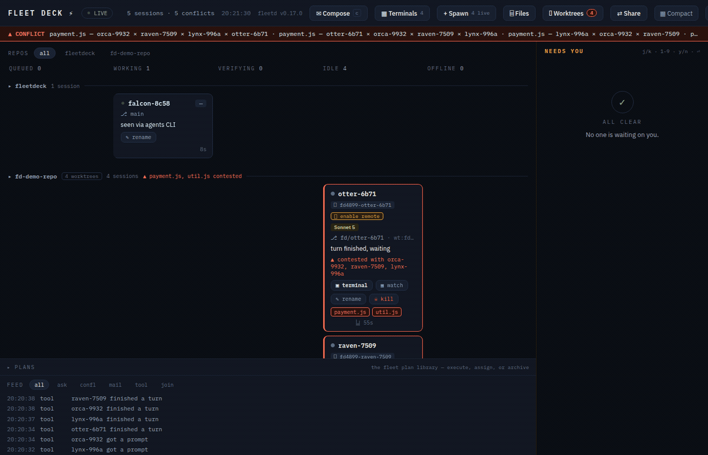

<p align="center">
  
</p>

# Fleet Deck ⚡

[](https://github.com/lacion/fleet-deck/actions/workflows/ci.yml)
[](LICENSE)
[](https://nodejs.org)

**Mission control for every Claude Code session on your machine.**

You know how it goes. You start one Claude Code session. Then one in a worktree, because you're organized. Then a third one "just to look something up," and a fourth because the second one seemed stuck. It is now 6 PM, two of them are editing `util.js` at the same time, one has been silently waiting forty minutes for you to approve `rm -rf node_modules`, and you honestly could not say which terminal tab is which.

Fleet Deck is the air-traffic control tower for that situation.

<p align="center">
  
</p>

Every session on the machine appears on one local board — **http://127.0.0.1:4711** — with a callsign (`falcon-a3f2`, `otter-91c4`, or `raven-PROJ-123` when it's working a Jira ticket... yes, the banner is literally the roster), a live column derived from what it's *actually doing*, and a mailbox. Sessions get whispered at when they're about to trample each other's files. Questions land in an amber rail you can answer from across the room. And when you're feeling ambitious, the board will spawn new workers, route tasks to whoever's idle, and file their plans in a library.

## What it does

- **See everything.** `queued → working → verifying → needs-you → idle → offline`, derived from hook telemetry — never self-reported, because sessions, like people, believe they are almost done. The model badge is derived the same way: Claude Code only reports the model at startup, so Fleet Deck reads it from the session transcript instead and the badge follows a mid-session `/model` switch rather than freezing on whatever the session happened to launch with.
- **Conflict radar.** Two sessions touching the same file within 30 minutes get warned *in context* ("coordinate, don't clobber"), the board flashes hazard-red, and yes, it's worktree-aware — the same file edited in two worktrees of one repo is a merge conflict introducing itself early.
- **Needs-you rail.** Permission prompts, multiple-choice questions, MCP forms, and trailing "should I use bcrypt or argon2?" questions all become cards you answer from the board. The terminal never even asks — it just prints `⎿ Allowed by PermissionRequest hook` and carries on, slightly smug.
- **Mail with honest latency.** Message any session, a whole repo, or everyone. Delivered at the next turn boundary — idle sessions usually wake within seconds (a small watcher taps them on the shoulder). The board never promises "instant," because we don't lie to you, even about milliseconds.
- **An orchestrator with no brain, on purpose.** `assign auto: fix the flaky test` picks the best candidate — idle first, least buried, right repo — with a SQL query, not a model call. The core makes **zero model calls**. Your tokens are yours.
- **A dynamic fleet.** The `+ Spawn` button starts a fresh interactive `claude` in a daemon-owned tmux window. Watch it work on the board, attach to the pane if you're nostalgic for terminals, kill it when it's done (there's a confirm; we've all misclicked).
- **A live terminal.** Click a board-spawned session's tmux chip and its pane opens in a modal — an xterm.js terminal bridged over WebSocket to a tmux control-mode client (`tmux -C attach`). No PTY, no native deps, and typing in the modal sends real keystrokes to the agent's pane: you're driving the actual session, not watching a replay. **Shift+Enter gives you a newline instead of a submit**, with nothing to configure: a terminal normally can't tell Shift+Enter from Enter — both are just a carriage return on the wire, which is why multi-line input needs `/terminal-setup` in a real emulator — but here the board *is* the emulator, so it simply sends the `ESC CR` that Claude Code's own keybinding asks for. The plain-tmux equivalent is still `tmux attach -t fleetdeck-4711:fd4711-<callsign>` — same pane, more ritual. **And you can paste a screenshot**: Ctrl+V an image into the pane and the board uploads it, writes it server-side, and types the file path into the agent's composer — the one image hand-off that works in a browser terminal, where the clipboard is yours and the shell is not. You press Enter; a paste never submits itself. (PNG, JPEG, GIF or WebP only, up to 10 MB; the file is written owner-only under `FLEETDECK_HOME` and pruned after 24 h or once 50 pile up, whichever comes first, and as of 0.9.1 the pane shows whether the paste landed or why it didn't.)
- **The wall of screens.** `▦ Terminals` opens every live agent at once, in a grid. All of them stream; exactly **one** types — the focused tile wears an amber ring and says *⌨ typing here*, and every other tile is stdin-disabled at the terminal itself, not merely ignored on the way out. A keystroke lands in a real agent and cannot be recalled, so which one it reaches is never something you have to infer. Click a tile to move the focus, `⤢` to promote it to full size. The whole grid shares **one** tmux control client, so the tenth tile costs a WebSocket, not a tenth tmux process.
- **Revive.** A reboot kills the panes, not the work — worktrees and transcripts survive on disk. One `⟲` click resumes a dead agent in its own worktree with its whole history: same callsign, same card. Whole columns at a time, if the night was rough.
- **Remote control.** Put an agent on claude.ai and drive it from your phone. The card grows a 📱 chip that opens the session — named after its callsign, so the thing in your pocket is recognizably the thing on your board.
- **A plan library.** Spawn a planner in plan mode. Its plan lands on the board as a rendered card *before* it can act. Approve it, or capture it to the library and release the planner. Later, execute the plan with your own custom instructions — optionally in unsupervised mode, which is behind a red two-step checkbox that says exactly what it does.

<p align="center">
  
</p>

## Install

```bash
claude plugin marketplace add lacion/fleet-deck   # the repo is its own marketplace
claude plugin install fleetdeck@fleetdeck
```

That's it. Your next `claude` — any terminal, any repo, no wrapper, no launcher, no ritual — brings the fleet up and appears on the board at **http://127.0.0.1:4711**. Type `/fleet` in any session for a live summary.

> **One thing to know about this channel:** a marketplace install tracks the repo's **default branch**, not a pinned release — every push to `main` runs at your next SessionStart. That's how we develop it, and the pipeline is gated (CODEOWNERS, hook-integrity CI, human-approved npm publishes), but if you want *releases and only releases*, the npm channel ships nothing else: `npm i -g fleetdeck` for [standalone mode](#standalone-mode), or pin your marketplace clone to a tag.

Requires **Node 22.5+** — and that's the whole list. There is nothing to `npm install`: the daemon ships as one bundled file and keeps its state in Node's built-in `node:sqlite`. Add **tmux** if you want the board to spawn workers or open their panes in the browser; everything else works without it. Linux, WSL2 and macOS. Windows-native is untested — if you try it, tell us what broke.

<details>
<summary>Working on Fleet Deck itself, or running it from a fork</summary>

```bash
claude plugin marketplace add /path/to/fleet-deck   # a local clone
claude plugin marketplace add your-org/your-fork    # or your own fork
claude plugin install fleetdeck@fleetdeck
```

After changing anything under `scripts/` you need `npm run bundle` (the daemon runs the bundle, not the source), and after changing the board, `npm run build` in `board/`. Then restart the daemon — or, if you also bumped the version, just start a new session and let the upgrade takeover do it.
</details>

## The 60-second tour

1. Install. Open the board. Launch a `claude` anywhere — a card appears in about one second.
2. Launch a second one in the same repo and have them both touch the same file. Watch the hazard ripple. Read the whisper each session receives. Feel seen.
3. Compose → ORCHESTRATOR → `assign auto: add input validation to the signup form`. The daemon picks a session; if it's idle, it wakes up and gets to work.
4. Nobody available? The board offers a **spawn a session for this** button. One click, one new worker, prefilled with the task.
5. Tick **batch** on the spawn form and paste in three tasks, one per line. Three agents, three worktrees, three branches, one click. Then hit **▦ Terminals** and watch all three work at once.
6. Spawn a planner (`permission mode: plan`), give it something gnarly, and capture its plan. Execute it later with an unsupervised worker while you make coffee. The coffee is not optional; you're a fleet commander now.

## Batch spawn: a fleet, not an agent

Tick **batch** in the spawn form and the prompt box stops being one prompt and becomes a task list — one agent per line:

```
fix the flaky worktree test
update the README install section
3x find the race in the spawn path
```

That's five agents in one click. Each one gets **its own git worktree** (`<repo>--fd-<callsign>`, or `<repo>--fd-<TICKET>-<animal>` when the source branch carries a Jira ticket) on **its own branch** (`fd/<callsign>` / `fd/<TICKET>-<animal>`), so they can all work the same repo without ever standing on each other's edits — that isolation is forced for a batch, not offered. The `3x` prefix runs a line several times, which is how you race three independent attempts at one nasty bug and keep the best.

Before anything launches, the form shows you the exact list and the exact count. **That preview is the guardrail** — there is deliberately no cap on how many agents may be live at once. It's your machine and your token budget; Fleet Deck's job is to make the size of what you're about to do impossible to miss, not to pick a number for you.

Then hit **▦ Terminals** and watch the whole fleet work at once:

<p align="center">
  
</p>

## How it works

```
 terminal 1..n : plain `claude` + this plugin's hooks
      │  events (http hooks, fail-open)      ▲ whispers, blocks, decisions
      ▼                                      │ (hook responses)
   fleetd — one Node daemon, loopback by default, SQLite state
      ▲                                      │ WebSocket push
      └────────── the board (React) ─────────┘
```

- **Zero wrapper.** The plugin's hooks make plain `claude` fleet-aware. The first session's SessionStart hook elects and launches the daemon; the port bind *is* the election.
- **Fail open, always.** Daemon down? Hooks time out silently and your sessions run exactly as before. Fleet Deck is not load-bearing; it's a tower, not a runway.
- **Zero model calls in the core.** Telemetry, conflict detection, routing, question relay: deterministic code. The only model cost added to your sessions is a ~100-token roster brief and the occasional whisper.
- **Loopback by default; the LAN costs a key.** Out of the box the daemon binds `127.0.0.1` and nothing else on earth can reach it. `FLEETDECK_BIND=0.0.0.0` opens it to your network — and *then* a token becomes mandatory, no exceptions, because this API can spawn unsupervised agents and type into their terminals ([LAN mode](#opening-the-board-on-your-other-machine-lan-mode)). Either way, your fleet does not phone home.

## Revive: a dead agent is not lost work

When the machine reboots — or tmux dies, or WSL2 decides it has had enough — the panes go. The work doesn't. Each agent's git worktree is still sitting on disk, and so is its Claude transcript, and the daemon knows both paths.

So an OFFLINE card whose worktree **and** transcript both survive grows a **⟲ revive** chip. Clicking it relaunches that spawn in the same worktree with `claude --resume <session-id>` (plus `--dangerously-skip-permissions`, if it had it before). Same callsign, same card, full history — because `--resume` keeps the session id, the revived agent's very first hook simply un-tombstones the card it already had, rather than opening a stranger's. When more than one card qualifies, the OFFLINE column head offers **⟲ Revive all (N)**.

It refuses honestly instead of guessing:

- **409** — the pane is somehow still alive, or that session already has a live spawn.
- **410** — the worktree or the transcript is gone. There is nothing to resume into and we will not invent one.

<p align="center">
  
</p>

We built this the morning after a WSL2 restart took an entire fleet out overnight. Five agents came back with their work intact. It remains the most satisfying button on the board.

## Move to tmux: adopt a session the board didn't spawn

Sessions you started yourself — a plain `claude` in a terminal — show up on the board via hooks, but the board doesn't own their pane: no terminal chip, no revive, no mail-to-pane. **⇥ move to tmux** fixes that. It resumes the session into a board-owned tmux window (`claude --resume <session-id>` — same session id, same card, full history), after which it's a first-class fleet worker: terminal modal, revive, kill, the lot.

Two entry states, one button:

- **The session already ended** (card in OFFLINE with a hook-proven end): the move happens immediately.
- **The session is live in your terminal:** two processes can't drive one conversation, so the click **arms** the card instead. Exit the session in your terminal whenever you're ready; the daemon catches the SessionEnd and resumes it into a managed pane within a second. The armed chip reads `⧗ armed — exit CLI to move`; clicking it again disarms, and an arm you forget about expires on its own after ~30 minutes (`FLEETDECK_ADOPT_ARM_MS`). A `/clear` doesn't count as an exit — the session is still live, and the arm survives it.

The arm is **durable intent, consumed exactly once**: it lives in SQLite, not in a timer. Disarm any time — including in the moment after you exit, while the move is still settling — and the cancel wins. If the session comes back to life before the move lands (you resumed it yourself), the move quietly cancels rather than leaving a standing order to ambush your next exit. And if the daemon dies in that window (a crash, or an upgrade takeover), the next boot's sweep finishes the move you asked for.

The dialog offers the same red, asks-twice **unsupervised** gate as the Spawn form if you want the moved session to keep `--dangerously-skip-permissions`; left unchecked, the resumed session's permission prompts land on the board like any spawned worker's.

It refuses honestly, like revive:

- **409, "board-owned"** — the session already has a spawn lineage, alive *or* dead. The board owns its pane story: **⟲ revive** is that button, and a second lineage would fight the first over the tmux window and the worktree. A card never offers both.
- **409, "no hook-proven end"** — the card is offline, but nothing ever *proved* the CLI exited: retention only presumed it dead after 3h of silence, the agents-CLI registry simply stopped reporting it, or it predates 0.7.0 and carries no provenance at all. A session that is quietly alive would be resumed into a *second billed session*, so absence of proof is never treated as proof. Arm it instead — if it's truly dead the arm just expires; if it's alive, exiting it completes the move.
- **410** — the working directory or the transcript is gone. Nothing to resume into.

Remote (claude.ai/code) sessions appear on the board too and aren't blocked from adopting — but resuming a web session's transcript locally is untested territory; the transcript check is the honest gate, not the session's origin.

## Remote control: the fleet in your pocket (`/rc`)

Claude Code can hand a session to claude.ai. Fleet Deck gives you three doors to that, and names the session after its callsign — so the thing you find in the claude.ai session list is recognizably the thing on your board.

- **From birth.** Tick **📱 remote control** on the Spawn form; the worker launches with `--remote-control <callsign>`.
- **On a running agent.** A live, idle board-spawned agent shows a **📱 enable remote** action. The daemon types `/rc <callsign>` into its pane, waits for the TUI to render, and harvests the resulting `https://claude.ai/code/session_…` link out of the pane's scrollback. That URL is written to no file — scrollback is genuinely the only source, which is why the daemon goes and reads the screen like a person would. (If the capture misses it, the chip says so, and the live terminal will show you the link itself.)
- **On revive.** A revived agent inherits the dead one's remote-control setting. The link is harvested fresh; the old URL died with the old session.

Either way, the card grows a **📱 remote ↗** chip that opens claude.ai in a new tab.

**The guard, because it matters:** enabling remote control is refused (409) unless the session is at a turn boundary — queued or idle. An agent that is mid-turn, or sitting on a permission dialog, is not waiting for a slash command; typing one there would *answer the dialog*. The board doesn't even offer the chip in those states, and the daemon refuses it if you ask anyway.

## Route a session through an LLM gateway

Claude Code will talk to anything that speaks the Anthropic wire format — [CLIProxyAPI](https://github.com/router-for-me/CLIProxyAPI), a corporate gateway, your own proxy — if you point `ANTHROPIC_BASE_URL` at it. Fleet Deck makes that a **per-session** choice instead of a machine-wide one, so a fleet can run some agents through a proxy and others straight to Anthropic, and the board tells you which is which.

**Set it up once**, on the Spawn form: hit **set up** next to 🛰 gateway and give it a base URL and a token.

| Setting | What it is |
| --- | --- |
| `gateway_base_url` | Where the gateway lives — `http://127.0.0.1:8317` for a stock CLIProxyAPI. `http://` and `https://` only, and **no credentials in the URL**: this value is shown on the board and travels in `/state`, so `user:pass@host` and `?api_key=…` are refused. Put the credential in `gateway_token`. |
| `gateway_token` | The credential. For CLIProxyAPI this is any entry from its `api-keys:` list. |
| `gateway_auth_style` | `bearer` (default) sends it as `Authorization: Bearer …`; `api-key` sends it as `x-api-key`. **If you get a 401, it's almost always this** — the credential is fine, it's just arriving in a header the gateway doesn't read. |
| `gateway_model_discovery` | On by default. Asks the gateway for its model list at startup so gateway-only model names show up in `/model`. |
| `gateway_default` | Off by default. When on, a spawn that says nothing routes through the gateway anyway. |

Then tick **🛰 route through …** on any spawn. Gateway-routed cards carry a **🛰 gateway** chip, and a revived agent keeps whatever routing its lineage had — resuming a conversation against a *different* provider than the one that wrote its transcript is not something that should happen quietly.

**The token never comes back.** It's stored on this machine and handed to the pane through tmux's own environment (`new-window -e`), so it stays out of the pane's command line and out of `ps`. The board is told `token_set: true` and nothing else — the `/state` snapshot is broadcast to every connected board, phones included, so the credential simply isn't in it. The **base URL is not secret** and deliberately *is* in there (you want to see where a session is going), which is exactly why it refuses to carry one.

**One upgrade note.** Board-spawned panes no longer inherit `ANTHROPIC_*` from the daemon's environment — that inheritance was how a single `export` in one terminal could silently reroute every session on the machine. If you authenticate Claude Code with an `ANTHROPIC_API_KEY` exported in your shell, move it to `~/.claude/settings.json` under `env`; sessions you start yourself are unaffected either way.

**Two things it will refuse, both loudly.** A half-configured gateway (a URL with no token, or the reverse) fails the spawn with a 400 rather than quietly billing your Anthropic account instead. And **remote control is unavailable on a gateway-routed session** — that one isn't our rule: Claude Code disables Remote Control whenever `ANTHROPIC_BASE_URL` points somewhere that isn't Anthropic, because claude.ai has no route to a session it isn't serving. Pick one; the form greys out whichever you didn't.

> Sessions you start yourself, in your own terminal, are outside this — Fleet Deck only steers the panes it launches. If you want *everything* on the gateway, put the variables in `~/.claude/settings.json` under `env` and leave this feature alone. What Fleet Deck adds is the per-session choice.

## Jira tickets: a callsign that tells you the work

A session's callsign is `<animal>-<4 hex>` by default (`raven-4b7f`) — memorable, but it says nothing about *what the session is on*. So when a session sits on a branch that carries a Jira key (`feature/PROJ-123-checkout`, `fd/PROJ-123-otter`), Fleet Deck swaps the hex for the ticket: **`raven-PROJ-123`**. The board card, the mailbox target, and the tmux window all read as the ticket you'd recognize from standup.

- **Auto-detected from the branch**, no config. It's read once at birth, and again the first time a ticketless session checks out a ticket branch — that rename happens exactly once and is announced in the ticker.
- **`ticket <callsign> <PROJ-123>`** from Compose → ORCHESTRATOR pins a ticket by hand; a manual pin wins over auto-detection and is never overwritten. `ticket <callsign> clear` drops it and restores the birth name.
- **One animal per ticket.** A fleet on one branch is the normal case, so every session on `PROJ-123` gets a *different* animal — `otter-PROJ-123`, `falcon-PROJ-123`, `raven-PROJ-123`. When all twelve animals are taken for a ticket, the thirteenth falls back to the hex suffix (a ticker line tells you), and a manual `ticket` command is the recovery.
- **Spawns name their artifacts ticket-first.** A worker spawned from a `PROJ-123` branch lands in the worktree `<repo>--fd-PROJ-123-<animal>` on branch `fd/PROJ-123-<animal>`, so sibling worktrees and branch lists group by ticket. Ticketless spawns keep today's `<repo>--fd-<callsign>` / `fd/<callsign>` format.

## Name a session yourself

The animal is the fleet's; the ID part is yours. `wren-a9e1` says nothing about what wren is *doing*, so rename it: **`wren-docs-review`**. Click the **✎** chip on the card (or in the drawer), or type `name wren-a9e1 docs-review` into Compose. `name <callsign> clear` puts the automatic name back — the ticket name if the card has a ticket, otherwise the name it was born with.

The animal never changes, and that is deliberate: twelve animals rotating through the fleet is what makes cards recognizable at a glance, and it keeps the one-animal-per-ticket rule intact. Names are letters, digits and dashes (a space or a dot would quietly break the card's own timeline filter and its tmux window name, so they're refused).

**A hand-typed name wins.** Branch ticket auto-detection will never rename over a name you chose — automation doesn't get to overrule you. An explicit `ticket` command still does, because that's you too. And mail addressed to the old name keeps arriving, exactly as with a ticket rename.

## `/clear` keeps your card

Claude Code doesn't keep a session's id across a `/clear` — it ends the old one and starts a fresh one behind the scenes. Fleet Deck follows the handoff: the new session **continues the same card**, with the same callsign, the same tmux pane, the same ticket, the same mailbox and the same armed move-to-tmux. You will see one ticker line saying the context was cleared, and nothing else changes.

(Before 0.7.1 it did not follow: the old card kept the pane while the new one collected the work, which is how a session ended up with a terminal button that drove a card that never updated. If your board still has a pair split that way, upgrading heals it at boot.)

**Upgrading an existing fleet:** as of 0.7.0 this is automatic — the next new session's SessionStart hook notices the running daemon is an older version, asks it to step down (SIGTERM, the same graceful shutdown as ever; state is SQLite, nothing is lost), and boots its own newer build. Strictly newer only, never a downgrade, and if anything about the handoff looks uncertain the hook fails open onto the running daemon. A manual restart still works and is never harmful. After the upgrade, any live session already sitting on a ticket branch renames itself once on its next hook event, and mail addressed to a session's old, pre-rename name still finds it.

## Retention, and the Clear button

Cards don't pile up forever. Nothing is ever deleted:

- A hook session that goes **silent for 3 hours** is presumed ended and lands in OFFLINE (`presumed ended (silent 3h)`). A late hook resurrects it — the tombstone is a timestamp, not a grave.
- An **offline card older than 24 hours** is archived off the board. The row stays in SQLite; it just stops competing for your attention.
- **⌫ Clear** (which only appears when there's something to clear) does all of that *now*: archives every offline card, expires their undelivered mail and open questions, kills dead panes it owns — and **lists** orphaned worktrees rather than removing them. Deleting a git worktree is a decision with your name on it, not a chore we'll quietly do behind your back.

Knobs: `FLEETDECK_PRESUME_DEAD_MS`, `FLEETDECK_RETAIN_OFFLINE_MS`.

## Standalone mode

Fleet Deck is a Claude Code plugin, and the daemon it needs is booted for it, lazily, by a
`SessionStart` hook. That is perfect on a laptop and useless on a remote dev box, where there may be
no Claude Code session at all and the only way in is a browser tab.

So it also runs as a service:

```bash
npm install -g fleetdeck
fleetdeck doctor            # Node 22.5+? tmux? claude? the plugin?
fleetdeck service install   # a systemd user unit, or a supervised wrapper if there's no systemd
fleetdeck service start
```

The board is now always on. Open it and **spawn an agent with no Claude Code session anywhere** —
type a repo path, click, and it comes up in a tmux pane you can watch, type into, and answer prompts
for, all from the browser. That was already true of the board; what standalone adds is a daemon that
exists without a session to boot it, and a way to reach it from somewhere other than localhost.

To reach it from a browser that isn't on the box, put it behind a reverse proxy and name the origin:

```bash
export FLEETDECK_TRUSTED_ORIGINS="https://board.example.com"
export FLEETDECK_PROXY_AUTH="trust"   # only if the proxy really does authenticate; default is `token`
```

Fleet Deck's same-origin wall is what keeps any website you visit from driving your fleet over
loopback, so it does not simply switch off — you widen it by exactly the origin you name, and not one
inch more. An origin you didn't name is still refused, and a typo is a startup refusal rather than a
board that mysteriously 403s.

The board itself is prefix-agnostic: it resolves its assets, API calls and WebSockets relative to
wherever it was loaded from, so it works at a domain root *or* under a path prefix
(`/apps/fleetdeck/`) behind nginx, Traefik, or a Coder path-based app.

Keep the plugin installed. The board can *launch* an agent without it, but the status, the model, the
edits and the permission prompts all arrive through the plugin's hooks — without it, cards appear and
then never move.

**→ [docs/CODER.md](docs/CODER.md)** is the full guide for [Coder](https://coder.com) workspaces:
a copy-pasteable `coder_script` + `coder_app`, why `subdomain = true` matters, and why there is no
systemd in that container.

A managed daemon is never evicted by a plugin hook. Normally the newest installed plugin takes the
port by SIGTERMing an older daemon; against a supervised service that would just start a fight with
the supervisor, so the service wins and the version drift is reported in your session brief instead.

## The fine print (read this bit)

- **Spawned sessions are real billed Claude sessions.** The spawn form says so — it shows you the exact list and count before anything launches, and that preview is the guardrail (there is deliberately no cap on how many agents may be live) — and nothing ever spawns without a human click (an *armed* move-to-tmux fires at SessionEnd, but the click that armed it was the decision — one-shot, cancellable, visible on the card, and it expires). `assign auto` routes to *existing* sessions only.
- **Unsupervised mode means unsupervised.** `--dangerously-skip-permissions` workers never produce permission cards. The checkbox is red and asks twice. Pair it with the fresh-worktree option and sleep better.
- **The permission relay is interactive-only.** Headless `claude -p` sessions deny permission-needing tools without consulting hooks — that's CLI behavior, not ours. Spawned fleet workers are interactive (in tmux) precisely so their prompts reach your board.
- **Version pin: Claude Code CLI 2.1.206+ (tested through 2.1.207).** Fleet Deck leans on a couple of behaviors the docs don't mention (they work; we checked, repeatedly, at some cost to our dignity). A guard test fails loudly if a CLI update drops them. Contract tests replay recorded hook payloads so schema drift is caught in CI, not in your fleet.
- **Ports:** `FLEETDECK_PORT` / `FLEETDECK_HOME` env vars; hooks are pinned to 4711 by default, so a truly separate fleet needs the port swapped in a copy of `hooks/hooks.json` too. On multi-user machines give each OS user their own port — TCP ports are shared per machine, and you probably don't want to co-manage a fleet with whoever else is on that box.

### Tmux isolation & the one-port rule

- **`FLEETDECK_TMUX_SOCKET`** — when set, the daemon runs every tmux command against that named server (`tmux -L <socket>`) instead of your default one. The tests and `demo/` scripts always set it, and the reason is a scar, not a style choice: tmux bakes the **first client's environment** into a new server's global env, and every window created later inherits it. We once let an acceptance run start the default tmux server from inside a test session — and that evening's production spawns dutifully inherited the test `FLEETDECK_PORT`/`FLEETDECK_HOME` and reported to a ghost daemon nobody was watching. The demo scripts now use a per-run socket (`fdaccept-<pid>`) and `kill-server` it on exit; your default tmux server is never touched. Leave the variable unset in production.
- **4711 is the supported production port.** Since 0.16.0 every hook event runs through a command shim (`scripts/fleet-hook.mjs`) that honors `FLEETDECK_PORT`, just like the SessionStart and watch scripts — so a custom port no longer splits hook traffic. The shims are also what authenticate hooks: they read `$FLEETDECK_HOME/token` and attach it, which is why a tokenless `/hook/*` curl now 401s.

### Opening the board on your other machine (LAN mode)

By default fleetd listens on `127.0.0.1` and nothing else can reach it. Set **`FLEETDECK_BIND=0.0.0.0`** and it binds every interface, printing a ready-to-paste URL per address:

```
fleetd up on http://0.0.0.0:4711 (pid 12345, …)
fleetd LAN http://192.168.8.223:4711/?t=2a62f3c9…
fleetd LAN http://fleetdeck.local:4711/?t=2a62f3c9…   (mDNS — needs a resolver on the peer)
```

Open one of those on the laptop and the board comes up; the key is consumed at boot and scrubbed straight back out of the address bar, where a live credential has no business sitting. The header's **⇄ Share** panel shows the same links with a QR code — point a phone camera at it.

<p align="center">
  
</p>

**The `?t=` is a password, and it is not decoration.** This API can spawn agents with `--dangerously-skip-permissions` and type keystrokes into their terminals: unauthenticated, it is remote code execution for anyone on the network. So LAN mode *requires* a token — there is no insecure switch, and fleetd refuses to start rather than open an unauthenticated listener. The rules:

- **Loopback needs no token for the ordinary routes** — browsing the board, watching sessions, hook traffic from *the fleet's own shims*. Since 0.16.0 the daemon mints a token on every boot and the **powerful** routes demand it even locally: typing into terminals (`/ws/term`), `POST /mail`, `gateway_*` settings writes, and unsupervised spawns. Your hooks authenticate automatically (they read `$FLEETDECK_HOME/token` via the shims), and the daemon prints the credentialed local link (`fleetd board http://127.0.0.1:4711/?t=…`) at startup — open that once and your browser keeps the key on this device. (On a shared multi-user box, other local users sit inside the loopback trust zone; `FLEETDECK_REQUIRE_TOKEN=on` closes *every* route behind the token — but note it cannot protect you from processes running as *your* user, which can read the token file. See SECURITY.md for the honest boundary.)
- **Everything else must present the token**, as `Authorization: Bearer <token>` or `?t=<token>`. Wrong or missing → 401, no data.
- **The static shell is public; every byte of fleet data is not.** The HTML and its JS bundle are served to anyone who asks — they contain no sessions, no callsigns, no key, just an empty board that knows how to ask for one. A stranger on the network gets that gate page and nothing else. This isn't a softening: a browser cannot put a key on the `<script>` tag inside the page it is already loading, so gating the shell doesn't hide the board, it just serves a blank one — and because loopback bypasses the gate, you'd never see it locally. Ask us how we know. (There's a test pinning it now.) The printed link carries the key in the query string for the same reason: no `Authorization` header exists on a first navigation.
- **Not a cookie, on purpose.** Cookies ride along automatically, so any web page you happened to visit could quietly make *your* browser POST to your board and hand itself a live agent. A bearer token can't be forged that way.
- The token is generated once into `FLEETDECK_HOME/token` (mode `0600`) — or set **`FLEETDECK_TOKEN`** yourself (16+ chars). Treat it like an SSH key. Rotate it by deleting the file and restarting.
- Untrusted networks (cafés, conferences, hotels): don't. Use **Tailscale** or an SSH tunnel — see below.

### Discovery: mDNS, and the honest caveats

In LAN mode the daemon advertises itself over multicast DNS / DNS-SD with a small dependency-free responder (no Avahi, no Bonjour install): an A record for **`fleetdeck.local`**, plus `_fleetdeck._tcp` and `_http._tcp` services so it turns up in service browsers. `FLEETDECK_MDNS=off` disables it; `FLEETDECK_MDNS_NAME` renames it (two people running Fleet Deck on one network *will* collide on `fleetdeck.local` — rename one).

It is a convenience, never a dependency: if port 5353 is taken, multicast is blocked, or the network eats it, mDNS degrades to a silent no-op and the printed IP URLs keep working. Resolving `.local` needs a resolver on the *other* machine — macOS and iOS have one built in, most Linux boxes need `avahi-daemon`, and Windows is unreliable without Bonjour. **If `fleetdeck.local` doesn't resolve for your peer, that's the peer's resolver, not the board — use the IP URL.**

For the specific case of moving between your own machines (and the one that survives leaving the house), **Tailscale beats mDNS**: a stable private IP, works off-LAN, and MagicDNS already gives you a name — no discovery protocol required. Bind LAN mode, open the board at the tailnet address, and the token still guards it.

### Every knob

All optional. Fleet Deck's defaults are the configuration we actually run.

| Variable | Default | What it does |
| --- | --- | --- |
| `FLEETDECK_PORT` | `4711` | Daemon port. The hook shims honor it — read the one-port rule above before changing it. |
| `FLEETDECK_HOME` | `~/.fleetdeck` | State directory: the SQLite db, the LAN token, watcher pid files. |
| `FLEETDECK_BIND` | `127.0.0.1` | Bind address. `0.0.0.0` is LAN mode, which makes a token mandatory. |
| `FLEETDECK_TOKEN` | generated into `$FLEETDECK_HOME/token` | The bearer token. Minimum 16 characters; the daemon refuses to start on a shorter one. Since 0.16.0 generated on **every** boot — loopback included — because hooks, `/ws/term`, `/mail`, gateway writes and unsupervised spawns all present it. |
| `FLEETDECK_REPOS_DIR` | `~/projects` (`/workspace` on a Coder workspace) | Where repo-mode spawns clone repositories that aren't local yet. The dialog's destination field can override and persist a different root; this env var sits between that setting and the default. |
| `FLEETDECK_BROWSE_ROOT` | home (`/workspace` on a Coder workspace) | The root of the global ⌸ Files explorer and the spawn form's 🗀 folder picker. The `browse_root` setting (set from the picker's "set as default root") wins over this; the root is always resolved server-side. |
| `FLEETDECK_TRUSTED_ORIGINS` | unset | Comma-separated origins allowed to reach the daemon, for running behind a reverse proxy — `https://board.example.com`, or one leading wildcard label (`https://*.coder.example.com`). A scheme is required. Without this, a proxied board loads and then 403s on every request. See [Standalone mode](#standalone-mode). |
| `FLEETDECK_PROXY_AUTH` | `token` | Who authenticates a proxied browser. `token`: it must still present the bearer token. `trust`: the reverse proxy already authenticated it (only sane when the proxy really does, e.g. Coder with `share = "owner"`). |
| `FLEETDECK_REQUIRE_TOKEN` | off | `on` requires the bearer token even over loopback on **every** route (`/state`, `/mail`, `/command`, `/api/*`, `/ws`, `/ws/term`, `/hook/*`); only `/health` and the public board shell stay exempt. Closes the loopback trust zone against other OS users on a shared machine (and the Host-rewriting reverse-proxy residual). It does **not** protect you from processes running as your own user — they can read the token file; that boundary doesn't exist on a single-account machine. The fleet's own hooks attach the token from `$FLEETDECK_HOME/token` automatically, so a normal single-user setup keeps working. |
| `FLEETDECK_MANAGED` | unset | Set to `1` by `fleetdeck serve`. Marks the daemon as supervisor-owned, so a plugin hook will never SIGTERM it to install a newer version. You do not set this by hand. |
| `FLEETDECK_MDNS` | on (LAN mode only) | `off` disables the mDNS/DNS-SD responder. |
| `FLEETDECK_MDNS_NAME` | `fleetdeck` | The advertised name — i.e. `fleetdeck.local`. Rename one of them when two fleets share a network. |
| `FLEETDECK_SPAWN` | on | `off` disables spawning entirely; the board hides every spawn control. |
| `FLEETDECK_STALE_MS` | `600000` (10 min) | How long a working/verifying card runs without telemetry before it's badged stale. |
| `FLEETDECK_HOLD_MS` | `50000` (50 s) | How long a question hook is held open awaiting a board answer. Clamped to 250 ms–60 s, under the 65 s hook timeout. |
| `FLEETDECK_NUDGE_MS` | `8000` (8 s) | Grace before a silent new pane gets its one bring-up Enter. Exactly once, ever — and since 0.16.0, never into a folder-trust or MCP-approval dialog: the nudge reads the pane first and holds those for you, with a 🔒 note on the card. |
| `FLEETDECK_SPAWN_REGISTER_MS` | `90000` (90 s) | How long a spawned pane may run without phoning home before it's flagged `stalled` — loudly, and never auto-respawned. |
| `FLEETDECK_PANE_MAIL_GRACE_MS` | `1500` (1.5 s) | Head start given to the watcher before mail is typed into an owned pane instead. |
| `FLEETDECK_PRESUME_DEAD_MS` | `10800000` (3 h) | Silence after which a session is presumed ended. A late hook undoes it. |
| `FLEETDECK_RETAIN_OFFLINE_MS` | `86400000` (24 h) | How long an offline card stays on the board before it's archived out (never deleted). |
| `FLEETDECK_RETAIN_LEDGER_MS` | `86400000` (24 h) | How long file-touch, command, conflict and settled-mail ledger rows live in SQLite before they're aged out; the conflict snapshot only aggregates file touches newer than this. |
| `FLEETDECK_CAPTURE_PAYLOADS` | off | `on` writes every hook payload to `$FLEETDECK_HOME/hook-payloads.jsonl` (mode `0600`) to debug schema drift. Off by default. Values under secret-looking key names, known token shapes (`sk-ant-`, `ghp_`, AWS keys, JWTs, PEM blocks, Bearer tokens…) and the daemon's own token are redacted; a secret buried in free text is only best-effort caught, so it's still raw telemetry — leave it off unless you're chasing a hook bug. |
| `FLEETDECK_RC_HARVEST_MS` | `2500` (2.5 s) | Delay before the daemon reads the pane's scrollback for the `claude.ai` remote-control link. |
| `FLEETDECK_ADOPT_ARM_MS` | `1800000` (30 min) | How long an armed **move to tmux** waits for you to exit the CLI before it expires. |
| `FLEETDECK_ADOPT_DELAY_MS` | `750` | Grace after a session's exit before the armed move resumes it, so the CLI can flush its final transcript lines. |
| `FLEETDECK_CLEAR_SUCCESSION_MS` | `30000` (30 s) | How long after a `/clear` a brand-new session id starting in the same directory is read as that session continuing. |
| `FLEETDECK_TERM` | on | `off` disables the live terminal (WebSocket + modal) altogether. |
| `FLEETDECK_TERM_REPAINT_MS` | `80` | Repaint coalescing window for the terminal bridge. |
| `FLEETDECK_TMUX_SOCKET` | unset | Run every tmux command against a named server (`tmux -L`). Tests and demos only — see the scar story above. |
| `FLEETDECK_AGENTS_CMD` | the `claude agents` CLI | Override the agents-listing command. Whitespace-split into argv and run with no shell, so quotes, pipes, `$()` and redirection are never interpreted — wrap a pipeline in an executable script and name the script here. `false` (or blank) disables that poller (hooks still feed the board). |
| `FLEETDECK_AGENTS_POLL_MS` | `10000` (10 s) | Agents-poll cadence, which also drives owned-pane liveness. Floor 100 ms. |
| `FLEETDECK_WATCH_POLL_MS` | `25000` (25 s) | The idle-session watcher's long-poll hold per request. Clamped 50 ms–25 s. |
| `FLEETDECK_WATCH_MAX_MS` | `7200000` (2 h) | Lifetime cap on a watcher process before it exits and waits for the next turn. |

A few deep-tuning knobs exist for edge cases and rarely need touching: `FLEETDECK_TERM_CMD_TIMEOUT_MS` (`10000`, 10 s — the terminal bridge's tmux command timeout), `FLEETDECK_TERM_INPUT_MAX_BYTES` (`262144`, 256 KiB — the ceiling on queued terminal stdin), `FLEETDECK_WS_BUFFER_MAX` (`1048576`, 1 MiB — the per-peer WebSocket send-buffer cap before that peer is dropped and resynced), and `FLEETDECK_AGENTS_IDLE_POLL_MS` (`60000`, 60 s — how often an empty agents registry is re-polled). The defaults are what we run.

`FLEETDECK_SPAWN_CMD`, `FLEETDECK_TERM_CMD` and the `FLEETDECK_TEST_*` family exist for the test harness — they replace tmux and the daemon with fixtures. They are not a supported way to run a fleet, and if you find yourself reaching for one in production, something has gone wrong upstream of this table.

## Development

```bash
npm install
npm test                             # ~400+ contract tests against a real daemon
npm run bundle                       # rebundle the daemon after touching scripts/fleetd/
npm run build:board                  # rebuild the React board into board-dist/
```

`npm test` runs the suite **serially** (`--test-concurrency=1`), and that is not a style preference. Every one of these tests boots a real daemon that binds a real port and drives a real tmux server; run them in parallel and they contend for both, and you get one or two failures a run — a *different* one each time, each passing in isolation. That looks exactly like flaky tests and is in fact a flaky harness.

The `demo/` scripts are live acceptance gates that start *real* Claude sessions (i.e., they cost money): `run-smoke.sh` (two sessions colliding on purpose), `run-accept-phase3.sh` (a permission approved from the board; a trailing question answered from the board), `run-accept-spawn.sh` (spawn → assign → board-approved permission → kill), `run-accept-plan.sh` (plan → capture → unsupervised execution). Run them deliberately, not casually.

## Credits

Designed and built by a fleet of Claude agents coordinating through contracts, reviewed by Codex, supervised by one human with a board — which is to say: Fleet Deck was built the way Fleet Deck works. The repo is its own proof of concept.

Board design: "Console" direction — ink navy, amber means *yours-to-act*, IBM Plex Mono for anything that's data. The light theme exists and is lovely; the dark theme is correct.

## License

MIT. Fly safe. ⚡
