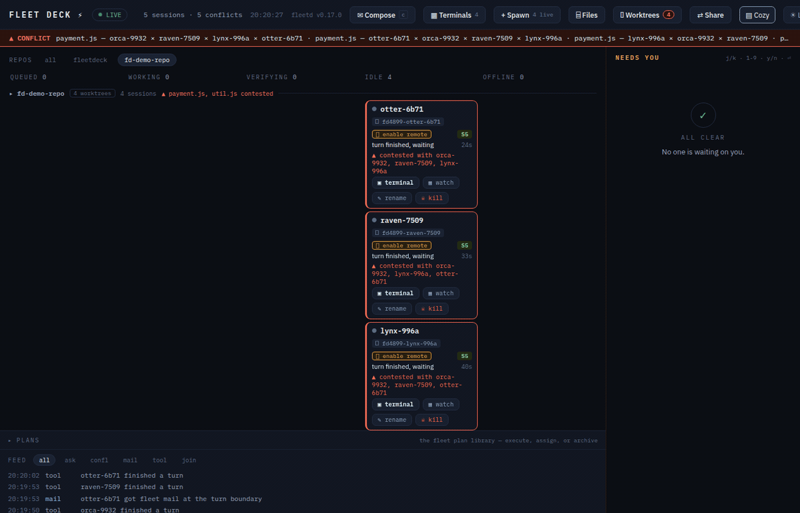
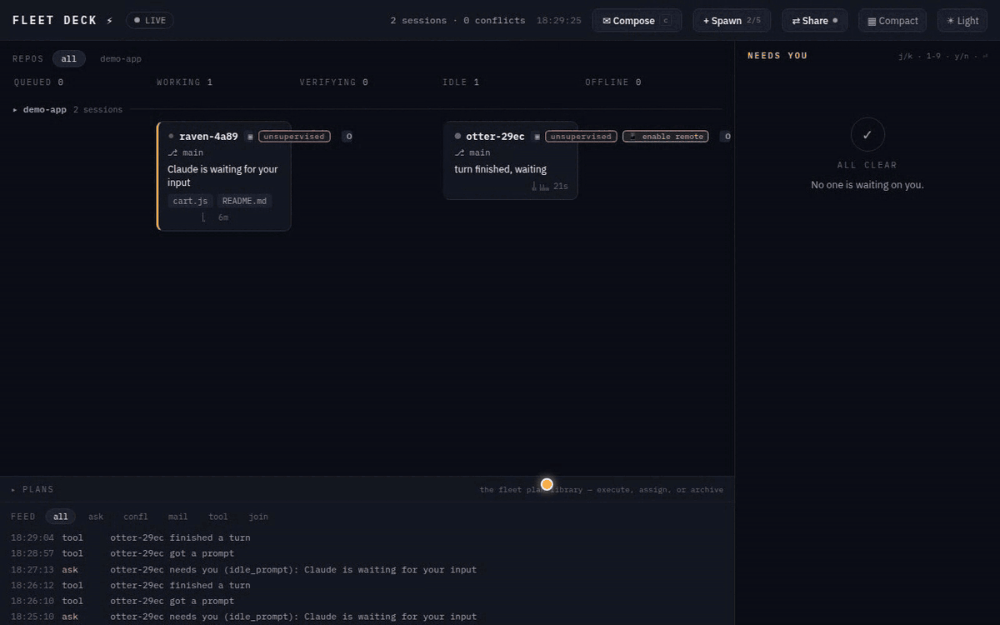
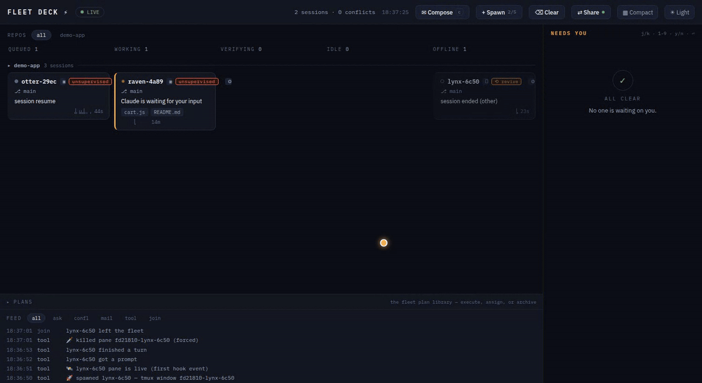
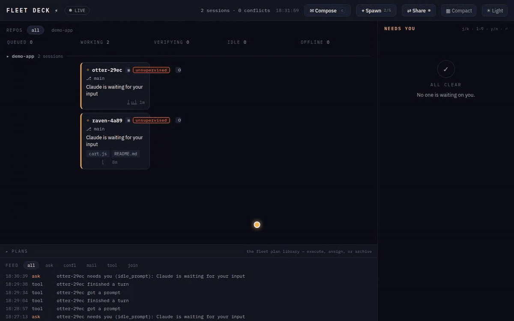

<p align="center">
  
</p>

# Fleet Deck ⚡

**Mission control for every Claude Code session on your machine.**

You know how it goes. You start one Claude Code session. Then one in a worktree, because you're organized. Then a third one "just to look something up," and a fourth because the second one seemed stuck. It is now 6 PM, two of them are editing `util.js` at the same time, one has been silently waiting forty minutes for you to approve `rm -rf node_modules`, and you honestly could not say which terminal tab is which.

Fleet Deck is the air-traffic control tower for that situation.

<p align="center">
  
</p>

Every session on the machine appears on one local board — **http://127.0.0.1:4711** — with a callsign (`falcon-a3f2`, `otter-91c4`... yes, the banner is literally the roster), a live column derived from what it's *actually doing*, and a mailbox. Sessions get whispered at when they're about to trample each other's files. Questions land in an amber rail you can answer from across the room. And when you're feeling ambitious, the board will spawn new workers, route tasks to whoever's idle, and file their plans in a library.

## What it does

- **See everything.** `queued → working → verifying → needs-you → idle → offline`, derived from hook telemetry — never self-reported, because sessions, like people, believe they are almost done.
- **Conflict radar.** Two sessions touching the same file within 30 minutes get warned *in context* ("coordinate, don't clobber"), the board flashes hazard-red, and yes, it's worktree-aware — the same file edited in two worktrees of one repo is a merge conflict introducing itself early.
- **Needs-you rail.** Permission prompts, multiple-choice questions, MCP forms, and trailing "should I use bcrypt or argon2?" questions all become cards you answer from the board. The terminal never even asks — it just prints `⎿ Allowed by PermissionRequest hook` and carries on, slightly smug.
- **Mail with honest latency.** Message any session, a whole repo, or everyone. Delivered at the next turn boundary — idle sessions usually wake within seconds (a small watcher taps them on the shoulder). The board never promises "instant," because we don't lie to you, even about milliseconds.
- **An orchestrator with no brain, on purpose.** `assign auto: fix the flaky test` picks the best candidate — idle first, least buried, right repo — with a SQL query, not a model call. The core makes **zero model calls**. Your tokens are yours.
- **A dynamic fleet.** The `+ Spawn` button starts a fresh interactive `claude` in a daemon-owned tmux window. Watch it work on the board, attach to the pane if you're nostalgic for terminals, kill it when it's done (there's a confirm; we've all misclicked).
- **A live terminal.** Click a board-spawned session's tmux chip and its pane opens in a modal — an xterm.js terminal bridged over WebSocket to a tmux control-mode client (`tmux -C attach`). No PTY, no native deps, and typing in the modal sends real keystrokes to the agent's pane: you're driving the actual session, not watching a replay. The plain-tmux equivalent is still `tmux attach -t fleetdeck-4711:fd4711-<callsign>` — same pane, more ritual.
- **Revive.** A reboot kills the panes, not the work — worktrees and transcripts survive on disk. One `⟲` click resumes a dead agent in its own worktree with its whole history: same callsign, same card. Whole columns at a time, if the night was rough.
- **Remote control.** Put an agent on claude.ai and drive it from your phone. The card grows a 📱 chip that opens the session — named after its callsign, so the thing in your pocket is recognizably the thing on your board.
- **A plan library.** Spawn a planner in plan mode. Its plan lands on the board as a rendered card *before* it can act. Approve it, or capture it to the library and release the planner. Later, execute the plan with your own custom instructions — optionally in unsupervised mode, which is behind a red two-step checkbox that says exactly what it does.

<p align="center">
  
</p>

## Install

```bash
claude plugin marketplace add lacion/fleet-deck   # the repo is its own marketplace
claude plugin install fleetdeck@fleetdeck
```

That's it. Your next `claude` — any terminal, any repo, no wrapper, no launcher, no ritual — brings the fleet up and appears on the board at **http://127.0.0.1:4711**. Type `/fleet` in any session for a live summary.

Requires **Node 22.5+** — and that's the whole list. There is nothing to `npm install`: the daemon ships as one bundled file and keeps its state in Node's built-in `node:sqlite`. Add **tmux** if you want the board to spawn workers or open their panes in the browser; everything else works without it. Linux, WSL2 and macOS. Windows-native is untested — if you try it, tell us what broke.

<details>
<summary>Working on Fleet Deck itself, or running it from a fork</summary>

```bash
claude plugin marketplace add /path/to/fleet-deck   # a local clone
claude plugin marketplace add your-org/your-fork    # or your own fork
claude plugin install fleetdeck@fleetdeck
```

After changing anything under `scripts/` you need `npm run bundle` (the daemon runs the bundle, not the source), and after changing the board, `npm run build` in `board/`. Then restart the daemon.
</details>

## The 60-second tour

1. Install. Open the board. Launch a `claude` anywhere — a card appears in about one second.
2. Launch a second one in the same repo and have them both touch the same file. Watch the hazard ripple. Read the whisper each session receives. Feel seen.
3. Compose → ORCHESTRATOR → `assign auto: add input validation to the signup form`. The daemon picks a session; if it's idle, it wakes up and gets to work.
4. Nobody available? The board offers a **spawn a session for this** button. One click, one new worker, prefilled with the task.
5. Spawn a planner (`permission mode: plan`), give it something gnarly, and capture its plan. Execute it later with an unsupervised worker while you make coffee. The coffee is not optional; you're a fleet commander now.

## How it works

```
 terminal 1..n : plain `claude` + this plugin's hooks
      │  events (http hooks, fail-open)      ▲ whispers, blocks, decisions
      ▼                                      │ (hook responses)
   fleetd — one Node daemon, loopback by default, SQLite state
      ▲                                      │ WebSocket push
      └────────── the board (React) ─────────┘
```

- **Zero wrapper.** The plugin's hooks make plain `claude` fleet-aware. The first session's SessionStart hook elects and launches the daemon; the port bind *is* the election.
- **Fail open, always.** Daemon down? Hooks time out silently and your sessions run exactly as before. Fleet Deck is not load-bearing; it's a tower, not a runway.
- **Zero model calls in the core.** Telemetry, conflict detection, routing, question relay: deterministic code. The only model cost added to your sessions is a ~100-token roster brief and the occasional whisper.
- **Loopback by default; the LAN costs a key.** Out of the box the daemon binds `127.0.0.1` and nothing else on earth can reach it. `FLEETDECK_BIND=0.0.0.0` opens it to your network — and *then* a token becomes mandatory, no exceptions, because this API can spawn unsupervised agents and type into their terminals ([LAN mode](#opening-the-board-on-your-other-machine-lan-mode)). Either way, your fleet does not phone home.

## Revive: a dead agent is not lost work

When the machine reboots — or tmux dies, or WSL2 decides it has had enough — the panes go. The work doesn't. Each agent's git worktree is still sitting on disk, and so is its Claude transcript, and the daemon knows both paths.

So an OFFLINE card whose worktree **and** transcript both survive grows a **⟲ revive** chip. Clicking it relaunches that spawn in the same worktree with `claude --resume <session-id>` (plus `--dangerously-skip-permissions`, if it had it before). Same callsign, same card, full history — because `--resume` keeps the session id, the revived agent's very first hook simply un-tombstones the card it already had, rather than opening a stranger's. When more than one card qualifies, the OFFLINE column head offers **⟲ Revive all (N)**.

It refuses honestly instead of guessing:

- **409** — the pane is somehow still alive, that session already has a live spawn, or the spawn cap is full.
- **410** — the worktree or the transcript is gone. There is nothing to resume into and we will not invent one.

<p align="center">
  
</p>

We built this the morning after a WSL2 restart took an entire fleet out overnight. Five agents came back with their work intact. It remains the most satisfying button on the board.

## Remote control: the fleet in your pocket (`/rc`)

Claude Code can hand a session to claude.ai. Fleet Deck gives you three doors to that, and names the session after its callsign — so the thing you find in the claude.ai session list is recognizably the thing on your board.

- **From birth.** Tick **📱 remote control** on the Spawn form; the worker launches with `--remote-control <callsign>`.
- **On a running agent.** A live, idle board-spawned agent shows a **📱 enable remote** action. The daemon types `/rc <callsign>` into its pane, waits for the TUI to render, and harvests the resulting `https://claude.ai/code/session_…` link out of the pane's scrollback. That URL is written to no file — scrollback is genuinely the only source, which is why the daemon goes and reads the screen like a person would. (If the capture misses it, the chip says so, and the live terminal will show you the link itself.)
- **On revive.** A revived agent inherits the dead one's remote-control setting. The link is harvested fresh; the old URL died with the old session.

Either way, the card grows a **📱 remote ↗** chip that opens claude.ai in a new tab.

**The guard, because it matters:** enabling remote control is refused (409) unless the session is at a turn boundary — queued or idle. An agent that is mid-turn, or sitting on a permission dialog, is not waiting for a slash command; typing one there would *answer the dialog*. The board doesn't even offer the chip in those states, and the daemon refuses it if you ask anyway.

## Retention, and the Clear button

Cards don't pile up forever. Nothing is ever deleted:

- A hook session that goes **silent for 3 hours** is presumed ended and lands in OFFLINE (`presumed ended (silent 3h)`). A late hook resurrects it — the tombstone is a timestamp, not a grave.
- An **offline card older than 24 hours** is archived off the board. The row stays in SQLite; it just stops competing for your attention.
- **⌫ Clear** (which only appears when there's something to clear) does all of that *now*: archives every offline card, expires their undelivered mail and open questions, kills dead panes it owns — and **lists** orphaned worktrees rather than removing them. Deleting a git worktree is a decision with your name on it, not a chore we'll quietly do behind your back.

Knobs: `FLEETDECK_PRESUME_DEAD_MS`, `FLEETDECK_RETAIN_OFFLINE_MS`.

## The fine print (read this bit)

- **Spawned sessions are real billed Claude sessions.** The spawn form says so, the cap defaults to 5, and nothing ever spawns without a human click. `assign auto` routes to *existing* sessions only.
- **Unsupervised mode means unsupervised.** `--dangerously-skip-permissions` workers never produce permission cards. The checkbox is red and asks twice. Pair it with the fresh-worktree option and sleep better.
- **The permission relay is interactive-only.** Headless `claude -p` sessions deny permission-needing tools without consulting hooks — that's CLI behavior, not ours. Spawned fleet workers are interactive (in tmux) precisely so their prompts reach your board.
- **Version pin: Claude Code CLI 2.1.206+ (tested through 2.1.207).** Fleet Deck leans on a couple of behaviors the docs don't mention (they work; we checked, repeatedly, at some cost to our dignity). A guard test fails loudly if a CLI update drops them. Contract tests replay recorded hook payloads so schema drift is caught in CI, not in your fleet.
- **Ports:** `FLEETDECK_PORT` / `FLEETDECK_HOME` env vars; hooks are pinned to 4711 by default, so a truly separate fleet needs the port swapped in a copy of `hooks/hooks.json` too. On multi-user machines give each OS user their own port — TCP ports are shared per machine, and you probably don't want to co-manage a fleet with whoever else is on that box.

### Tmux isolation & the one-port rule

- **`FLEETDECK_TMUX_SOCKET`** — when set, the daemon runs every tmux command against that named server (`tmux -L <socket>`) instead of your default one. The tests and `demo/` scripts always set it, and the reason is a scar, not a style choice: tmux bakes the **first client's environment** into a new server's global env, and every window created later inherits it. We once let an acceptance run start the default tmux server from inside a test session — and that evening's production spawns dutifully inherited the test `FLEETDECK_PORT`/`FLEETDECK_HOME` and reported to a ghost daemon nobody was watching. The demo scripts now use a per-run socket (`fdaccept-<pid>`) and `kill-server` it on exit; your default tmux server is never touched. Leave the variable unset in production.
- **4711 is the supported production port.** The plugin's http hooks in `hooks/hooks.json` are pinned to 4711, while the SessionStart and watch scripts honor `FLEETDECK_PORT` — so running a fleet on any other port splits your hook traffic between two daemons, and neither one sees the whole picture. If you genuinely need a different port, swap it in a copy of `hooks/hooks.json` too (see the ports note above).

### Opening the board on your other machine (LAN mode)

By default fleetd listens on `127.0.0.1` and nothing else can reach it. Set **`FLEETDECK_BIND=0.0.0.0`** and it binds every interface, printing a ready-to-paste URL per address:

```
fleetd up on http://0.0.0.0:4711 (pid 12345, …)
fleetd LAN http://192.168.8.223:4711/?t=2a62f3c9…
fleetd LAN http://fleetdeck.local:4711/?t=2a62f3c9…   (mDNS — needs a resolver on the peer)
```

Open one of those on the laptop and the board comes up; the key is consumed at boot and scrubbed straight back out of the address bar, where a live credential has no business sitting. The header's **⇄ Share** panel shows the same links with a QR code — point a phone camera at it.

<p align="center">
  
</p>

**The `?t=` is a password, and it is not decoration.** This API can spawn agents with `--dangerously-skip-permissions` and type keystrokes into their terminals: unauthenticated, it is remote code execution for anyone on the network. So LAN mode *requires* a token — there is no insecure switch, and fleetd refuses to start rather than open an unauthenticated listener. The rules:

- **Loopback needs no token, ever.** Your hooks and your local board keep working exactly as before — this is why LAN mode changes nothing about a normal single-machine setup.
- **Everything else must present the token**, as `Authorization: Bearer <token>` or `?t=<token>`. Wrong or missing → 401, no data.
- **The static shell is public; every byte of fleet data is not.** The HTML and its JS bundle are served to anyone who asks — they contain no sessions, no callsigns, no key, just an empty board that knows how to ask for one. A stranger on the network gets that gate page and nothing else. This isn't a softening: a browser cannot put a key on the `<script>` tag inside the page it is already loading, so gating the shell doesn't hide the board, it just serves a blank one — and because loopback bypasses the gate, you'd never see it locally. Ask us how we know. (There's a test pinning it now.) The printed link carries the key in the query string for the same reason: no `Authorization` header exists on a first navigation.
- **Not a cookie, on purpose.** Cookies ride along automatically, so any web page you happened to visit could quietly make *your* browser POST to your board and hand itself a live agent. A bearer token can't be forged that way.
- The token is generated once into `FLEETDECK_HOME/token` (mode `0600`) — or set **`FLEETDECK_TOKEN`** yourself (16+ chars). Treat it like an SSH key. Rotate it by deleting the file and restarting.
- Untrusted networks (cafés, conferences, hotels): don't. Use **Tailscale** or an SSH tunnel — see below.

### Discovery: mDNS, and the honest caveats

In LAN mode the daemon advertises itself over multicast DNS / DNS-SD with a small dependency-free responder (no Avahi, no Bonjour install): an A record for **`fleetdeck.local`**, plus `_fleetdeck._tcp` and `_http._tcp` services so it turns up in service browsers. `FLEETDECK_MDNS=off` disables it; `FLEETDECK_MDNS_NAME` renames it (two people running Fleet Deck on one network *will* collide on `fleetdeck.local` — rename one).

It is a convenience, never a dependency: if port 5353 is taken, multicast is blocked, or the network eats it, mDNS degrades to a silent no-op and the printed IP URLs keep working. Resolving `.local` needs a resolver on the *other* machine — macOS and iOS have one built in, most Linux boxes need `avahi-daemon`, and Windows is unreliable without Bonjour. **If `fleetdeck.local` doesn't resolve for your peer, that's the peer's resolver, not the board — use the IP URL.**

For the specific case of moving between your own machines (and the one that survives leaving the house), **Tailscale beats mDNS**: a stable private IP, works off-LAN, and MagicDNS already gives you a name — no discovery protocol required. Bind LAN mode, open the board at the tailnet address, and the token still guards it.

### Every knob

All optional. Fleet Deck's defaults are the configuration we actually run.

| Variable | Default | What it does |
| --- | --- | --- |
| `FLEETDECK_PORT` | `4711` | Daemon port. The plugin's http hooks are pinned to 4711 — read the one-port rule above before changing it. |
| `FLEETDECK_HOME` | `~/.fleetdeck` | State directory: the SQLite db, the LAN token, watcher pid files. |
| `FLEETDECK_BIND` | `127.0.0.1` | Bind address. `0.0.0.0` is LAN mode, which makes a token mandatory. |
| `FLEETDECK_TOKEN` | generated into `$FLEETDECK_HOME/token` | The LAN bearer token. Minimum 16 characters; the daemon refuses to start on a shorter one. |
| `FLEETDECK_MDNS` | on (LAN mode only) | `off` disables the mDNS/DNS-SD responder. |
| `FLEETDECK_MDNS_NAME` | `fleetdeck` | The advertised name — i.e. `fleetdeck.local`. Rename one of them when two fleets share a network. |
| `FLEETDECK_MAX_SPAWNED` | `5` | Cap on simultaneously live board-spawned agents. Revive counts against it too. |
| `FLEETDECK_SPAWN` | on | `off` disables spawning entirely; the board hides every spawn control. |
| `FLEETDECK_STALE_MS` | `600000` (10 min) | How long a working/verifying card runs without telemetry before it's badged stale. |
| `FLEETDECK_HOLD_MS` | `50000` (50 s) | How long a question hook is held open awaiting a board answer. Clamped to 250 ms–60 s, under the 65 s hook timeout. |
| `FLEETDECK_NUDGE_MS` | `8000` (8 s) | Grace before a silent new pane gets its one bring-up Enter (the trust dialog). Exactly once, ever. |
| `FLEETDECK_SPAWN_REGISTER_MS` | `90000` (90 s) | How long a spawned pane may run without phoning home before it's flagged `stalled` — loudly, and never auto-respawned. |
| `FLEETDECK_PANE_MAIL_GRACE_MS` | `1500` (1.5 s) | Head start given to the watcher before mail is typed into an owned pane instead. |
| `FLEETDECK_PRESUME_DEAD_MS` | `10800000` (3 h) | Silence after which a session is presumed ended. A late hook undoes it. |
| `FLEETDECK_RETAIN_OFFLINE_MS` | `86400000` (24 h) | How long an offline card stays on the board before it's archived out (never deleted). |
| `FLEETDECK_RC_HARVEST_MS` | `2500` (2.5 s) | Delay before the daemon reads the pane's scrollback for the `claude.ai` remote-control link. |
| `FLEETDECK_TERM` | on | `off` disables the live terminal (WebSocket + modal) altogether. |
| `FLEETDECK_TERM_MAX_VIEWERS` | `4` | Concurrent viewers per pane. |
| `FLEETDECK_TERM_REPAINT_MS` | `80` | Repaint coalescing window for the terminal bridge. |
| `FLEETDECK_TMUX_SOCKET` | unset | Run every tmux command against a named server (`tmux -L`). Tests and demos only — see the scar story above. |
| `FLEETDECK_AGENTS_CMD` | the `claude agents` CLI | Override the agents-listing command. `false` disables that poller (hooks still feed the board). |
| `FLEETDECK_AGENTS_POLL_MS` | `10000` (10 s) | Agents-poll cadence, which also drives owned-pane liveness. Floor 100 ms. |
| `FLEETDECK_WATCH_POLL_MS` | `25000` (25 s) | The idle-session watcher's long-poll hold per request. Clamped 50 ms–25 s. |
| `FLEETDECK_WATCH_MAX_MS` | `7200000` (2 h) | Lifetime cap on a watcher process before it exits and waits for the next turn. |

`FLEETDECK_SPAWN_CMD`, `FLEETDECK_TERM_CMD` and the `FLEETDECK_TEST_*` family exist for the test harness — they replace tmux and the daemon with fixtures. They are not a supported way to run a fleet, and if you find yourself reaching for one in production, something has gone wrong upstream of this table.

## Development

```bash
npm install
node --test --test-concurrency=1     # 170 contract tests against a real daemon
npm run bundle                       # rebundle the daemon after touching scripts/fleetd/
npm run build:board                  # rebuild the React board into board-dist/
```

The `demo/` scripts are live acceptance gates that start *real* Claude sessions (i.e., they cost money): `run-smoke.sh` (two sessions colliding on purpose), `run-accept-phase3.sh` (a permission approved from the board; a trailing question answered from the board), `run-accept-spawn.sh` (spawn → assign → board-approved permission → kill), `run-accept-plan.sh` (plan → capture → unsupervised execution). Run them deliberately, not casually.

## Credits

Designed and built by a fleet of Claude agents coordinating through contracts, reviewed by Codex, supervised by one human with a board — which is to say: Fleet Deck was built the way Fleet Deck works. The repo is its own proof of concept.

Board design: "Console" direction — ink navy, amber means *yours-to-act*, IBM Plex Mono for anything that's data. The light theme exists and is lovely; the dark theme is correct.

## License

MIT. Fly safe. ⚡
