# Fleet Deck v1.0 — target-state design spec & change manifest

*The capstone of [Fleet Deck v1.0](./README.md). Two halves: **Part 1** describes v1.0 as a finished system, present tense, as if you were reading the docs the day it ships. **Part 2** is the complete before→after delta from today's **v0.22.4** — every table, route, module, config, and gate that changes. It composes the pillar docs into one picture; where you want the *why* or the mechanics, it links to them. Written 2026-08-07 against the actual tree.*

---

# Part 1 — The deck at 1.0

## 1.1 The shape, in one picture

```mermaid
flowchart LR
  subgraph AGENTS["Agents — driven by default, observed always"]
    CC["Claude Code<br/>settings.json hooks"]
    CX["Codex<br/>hooks engine (opt-in)"]
  end
  subgraph DRIVE["Drive tier (P7) — native protocol"]
    DSDK["claudeSdk — Agent SDK query()<br/>approve · interrupt · steer · resume"]
    DAPP["codexAppServer — app-server<br/>(after Claude)"]
  end
  subgraph INTAKE["Intake — normalize at the edge"]
    HC["POST /hook/:event"]
    HX["POST /codex-hook/:event"]
    CANON["canonical events + schema_version<br/>(contracts/*.ts)"]
  end
  subgraph STRAT["Provider strategy objects"]
    SC["claude floor · claudeSdk override"]
    SX["codex floor · codexAppServer override"]
  end
  subgraph CORE["Deterministic core — provider-free, zero model calls"]
    DB[("SQLite: sessions · spawns(+base_ref) · mail<br/>questions · completions · event-stream · accounts")]
    GIT["git-only: worktrees · per-turn checkpoint refs · diff"]
  end
  subgraph SURF["Board surfaces — loopback"]
    GRID["Terminal grid (runner-in-a-pane)"]
    STREAM["Slack-style stream<br/>channels · cursors"]
    CARD["Cards: diff · checkpoints · revert · usage"]
    CHAT["Chat — live turn view when driven"]
  end
  subgraph CTRL["Control API"]
    TOK["token classes: worker · operator"]
    COMP["waitable completions"]
    ANS["drive: approve · interrupt · steer"]
  end
  FORGE["Forge via the user's own gh/glab<br/>PR-scoped write: allowlist + confirm + audit"]
  DRIVE -. "drives (falls open to floor)" .-> AGENTS
  CC --> HC --> CANON
  CX --> HX --> CANON
  CANON --> CORE
  STRAT --> CORE
  CTRL --> DRIVE
  CORE --> SURF
  CTRL --> CORE
  FORGE --> CORE
```

Agents are **driven by default and observed always** (P7): the drive tier owns the session through its native protocol — the Agent SDK for Claude now, the `app-server` for Codex after — while the *same* config-resident hooks keep POSTing to intake, so the core still sees a pure canonical-event stream and every card stays honestly derived. When a driver is down or unavailable the session **falls back to the observe-only floor** (plain CLI in a pane) — the fleet never darks. The core is arithmetic, SQL, and git; it makes **zero model calls** in either role. Everything is served over **loopback**. The plugin-embedded daemon still launches from the plugin's own hooks — now on **Bun** (single-runtime), still **fail-open**. Same membrane — only now it can also steer, because steering a session and observing it turn out to be the very same hooks firing.

## 1.2 A day on the deck

The operator opens the board. The **operations strip** shows each session's burn against its tightest reset window, an 80% chip where one is close, fleet-total underneath; two windows read **"unknown"** and say so rather than guess (P4).

They browse GitHub issues from the board and **fan out four workers from four issues** — one worktree each, ticket-named (`repo--fd-PROJ-123-heron`), the issue body prefilled into the prompt **fenced as untrusted** and the spawn forced **supervised**, because issue text is third-party (P3). Two workers are `claude`, two are `codex`; every card is **honestly derived**. The `claude` workers are **driven** — Fleet Deck owns their sessions through the Agent SDK, so their approvals, interrupts, and steering all work from the board or a phone — while the `codex` workers run on the **observe floor** for now (drive lands after Claude), turn-level with shell telemetry, labeled *reduced*, no conflict radar (P1, P7).

They watch the **Slack-style stream** — a channel per session and per repo — turn boundaries, tool actions, needs-you prompts, and mail rendered as messages (P6). A driven `claude` worker raises a `needs-you`; the operator **answers it straight from the channel — a real answered approval over the SDK, not a paste into a pane** (P7). A `codex` worker on the floor raises a shell approval too; there the answer is display-plus-mail until Codex earns its drive tier. Meanwhile a **coordinator session** they blessed as an *operator* **drives its own sub-fleet** — answering approvals, interrupting a wrong turn, steering the next one — through the control API, and **blocks on waitable completions** — `curl /orchestration/check?wait` — waking only when a worker posts `done` (P5, P7).

A worker finishes. The operator opens its card: **diff since spawn** against the recorded base ref, and **per-turn checkpoints** — they **revert one bad turn** (the agent is idle, so revert is allowed), annotate three diff lines, and send **one batched mail** back (P2). The worker revises in a single pass.

They point at the resulting PR. Fleet Deck checks the branch out in a fresh worktree and **spawns a reviewer running the operator's own `security-review` skill** — the daemon spawns and checks out; the *agent* reviews (P3, core stays model-free). Satisfied, they **create the PR and post the review via their own `gh`**, through the verb allowlist, with a board confirm and a feed audit line — no token ever touches `/state` or a command line (P3).

Account A is fifteen minutes from reset, so they **launch the next batch on account B** and watch the per-account bars rebalance (P4). Nothing left the machine; nothing called a model but the agents themselves.

## 1.3 The seam, composed

- **Intake normalization.** `/hook/:event` (Claude) and `/codex-hook/:event` (Codex) each map their vendor vocabulary onto **canonical events** (`session-start, prompt, tool-start, tool-end, needs-you, turn-end, session-end, file-changed, cwd-changed` + `provider` + `schema_version`) defined in `contracts/`. The state machine consumes canonical events only and no longer knows provider names. Detail: [architecture](./architecture.md).
- **Provider strategy objects.** The non-event coupling (argv, resume, pane identity, transcript path, liveness, usage reader, nudge gate) lives behind one object per provider. Claude's is extracted from today's code; Codex's implements the Tier A **floor** subset and returns **"unsupported"** elsewhere, so cards render exactly what the provider can honestly support.
- **The drive override (P7).** The same strategy object has a drive dimension: `claudeSdk` (now) and `codexAppServer` (after Claude) override a handful of fields — spawn/resume become the driver, `needsYouAnswer` becomes *answerable*, plus new `interrupt`/`steer` — while Layer-3 intake keeps firing unchanged. Drive is the default a session gets; a down driver falls back to the observe-only floor. Detail: [P7](./p7-drive-and-observe.md), [architecture](./architecture.md#the-drive-override-layer-4--p7).
- **The provider-free core (the membrane).** The SQLite store, callsigns/tickets, worktrees, mail queue + transport, questions, completions, checkpoints, the event-stream, and the board — none of them branch on `provider`, and none call a model even when a session is driven. If one ever does, the seam has leaked.

## 1.4 The data model at 1.0

| Store | Holds | New at 1.0 |
|-------|-------|-----------|
| `sessions` | one row per observed session | — (already carries `source`) |
| `events` | the canonical event log | **`provider` column**; a **per-session turn counter** |
| `spawns` | worktree/branch bookkeeping | **`base_ref` / `base_oid`** (the diff/checkpoint foundation, P2) |
| `mail` | leased + acked transport | — (reused verbatim by notes→mail and stream posts) |
| `questions` | typed durable needs-you records | — (the pattern T0.1 copies) |
| **`completions`** | `task_id, session_id, kind(done\|blocked\|question), payload, status, acked_at` | **new table** (P5) |
| **`event_stream`** | `at, session_id, repo_id, type, payload` — the Slack-style feed | **new table** + retention + read cursors (P6) |
| **`accounts`** | per-session `config_home`, per-account usage attribution | **new** (P4; pinning is a stretch) |
| git refs | `refs/fleetdeck/<callsign>/turn-<n>` — per-turn checkpoints | **new namespace**, git-side not SQLite (P2) |

All schema changes arrive as **numbered, transactional migrations under `PRAGMA user_version`** — replacing today's ~30 unversioned, untransacted `ALTER TABLE` introspection branches (`db.mjs:261-386`). See [validation-and-gates](./validation-and-gates.md).

## 1.5 The control surface at 1.0

| Route | Purpose | Authz at 1.0 |
|-------|---------|--------------|
| `POST /hook/:event` | Claude hook intake | loopback |
| **`POST /codex-hook/:event`** | Codex hook intake | loopback |
| `POST /api/spawn` | spawn a worker | **operator token when it carries `setup_cmd`/bypass** (today: tokenless on loopback — the P0) |
| `POST /mail`, `/mail/ack` | mail transport | worker token |
| `GET /state` | snapshot | worker token |
| `GET /api/watch` | 25 s long-poll (existing) | worker token |
| **`GET /orchestration/check?wait&types`** | waitable completions | worker token (P5) |
| **diff route** | `git diff base..HEAD` + `status --porcelain` | worker token (P2) |
| **forge routes** | issue read, PR checkout, PR-scoped write | operator; write via allowlist + confirm + audit (P3) |
| **usage routes** | per-session/fleet/per-account burn | worker token (P4) |
| **skill route** | the daemon-served, versioned control skill | loopback (P5 T0.2) |
| `POST arm-unsupervised`, `/ws/term` | existing power routes | operator token |

Two token classes replace one flat bearer: **worker** (mail/state/completions/usage) and **operator** (spawn/kill/arm/forge-write) — the latter held by humans and by explicitly-blessed coordinator sessions. Agent-initiated spawns are **capped by a per-hour quota** (`spawnCapability` has no cap today). Detail: [P5](./p5-programmable-fleet.md).

## 1.6 The board at 1.0

> Control-level detail — every button, field, modal, state, and keyboard path, including the changed spawn button, the new ⚙ Settings modal, and the full terminal-access matrix — lives in the **[ui-spec](./ui-spec.md)**. This section is the summary.

- **Terminal grid** — shipped today; unchanged in kind. For a **driven** session the pane is a **runner-in-a-pane** — Fleet Deck renders the live driven stream and it stays authoritative (P7, [README rule 5](./README.md#the-doctrine-evolved)).
- **Slack-style stream** — a new structured-event subsystem: channel-per-session/repo, read cursors, selective tool events (not a firehose), post-into-channel = mail; for a driven session, posting a reply **steers the turn** rather than queuing paste-mail (P6, P7).
- **Cards** — gain the review deck: diff-since-spawn, per-turn checkpoints, "what changed this turn," idle-gated revert, line-anchored notes → one batched mail (P2); plus usage chips and per-account bars (P4); plus, for driven sessions, **answerable approvals, interrupt, and steer** on the card itself (P7).
- **Chat** — optional, explicitly secondary: a **turn-level thread** (final assistant text per turn + outbound mail); **full in-progress rendering rides the drive tier's partial-message stream where a session is driven** (P7's `includePartialMessages`), the deferred-live-tailer of the observe-only past. The terminal stays authoritative (P6).
- **Permission ladder** — the two overlapping controls (the `default/acceptEdits/plan/bypassPermissions` dropdown *and* the separately-armed unsupervised checkbox) consolidate into **one four-mode ladder** — Supervised / Auto-accept-edits / Auto / Full-access — mapped across Claude's `permissionMode` (driven) / `--permission-mode` (floor) and Codex's approval×sandbox grid (P6, P7).
- **Types** — the board consumes `contracts/` (killing the `useFleetState.js` comment-contract); `.jsx → .tsx` opportunistically (F1 / [ts-migration](./ts-migration.md)).

## 1.7 Invariants that still hold

The five, with #1 amended by P7 and two the review sharpened:

1. **Observe always; drive by default; fall open to observe** (amended — P7, [README rule 1](./README.md#the-doctrine-evolved)). Fleet Deck drives Claude via the Agent SDK now and Codex via the app-server after it — but the *same* config-resident hooks keep firing under drive, so the observe membrane holds and every card stays a pure derivation from canonical events. A down driver falls back to the observe-only floor; the fleet never darks. Driving is a session's process being owned, **not** the daemon calling a model.
2. **Zero model calls in the core** — review-a-PR spawns an agent; a driven session is a spawned driver child; the daemon stays arithmetic/SQL/git either way.
3. **Forge write is PR-scoped only** — the user's own `gh`/`glab`, verb allowlist, never a stored token, never the hosting workflow.
4. **Loopback, no phone-home.**
5. **Terminal-authoritative** — the terminal (a runner-in-a-pane for driven sessions) is primary; every view is a board page. Plugin-vs-app packaging is a post-1.0 call ([README rule 5](./README.md#the-doctrine-evolved)).
6. **(new) A privilege model, not just the human gate** — token classes + spawn caps.
7. **(new) An injection boundary** — forge text is untrusted; issue-flow spawns default supervised.

---

# Part 2 — Everything that changes, v0.22.4 → v1.0

The full delta, by subsystem. "Before" is the tree today; "After" is 1.0.

## 2.1 Change manifest

### Language, build & packaging
- **Source:** 34 `.mjs` modules (18,260 loc) → **mixed `.ts`/`.mjs`**, converted file-by-file (giants may remain `.mjs` at the cut — that's fine). New `contracts/*.ts`. See [ts-migration](./ts-migration.md).
- **Type-checking:** none (no `tsc` in repo) → **`tsc --noEmit` a required CI gate** + runtime validation of hostile boundary JSON.
- **Bundler:** esbuild, unchanged — it already handles `.ts` by extension; the shipped `fleetd.bundle.mjs` stays plain JS.
- **Dev/CI runtime:** **Bun 1.3.14** — it strips TypeScript natively, so the daemon, CLI, and tests run the `.ts` source directly; the plugin hook floor execs its committed `fleet-*.mjs` shims under the same Bun; `engines` is now `bun >=1.3.14` (the Node floor was deleted). Production still execs the committed bundle (under Bun).
- **Distribution:** `npm i -g` / plugin — both now the **single Bun runtime** (`bun:sqlite` behind the `sqlite.ts` seam; `dependencies: {}`). An optional Bun `--compile` single binary + `brew` rides on top as packaging, independently cuttable.

### Providers & hooks
- **Providers:** Claude only → **Claude + Codex**, each in two roles (observe **floor** + **drive** tier). New `/codex-hook/:event` intake; Fleet Deck writes Codex telemetry hooks into `~/.codex/hooks.json` and flips `[features].codex_hooks` — **a config mutation gated behind explicit consent + an uninstall story**.
- **Seam:** Claude-coupling smeared across `events.mjs:273-424` + 8 other categories → **intake normalization + a provider strategy object** (architecture Layers 3–4), with a **drive override** dimension on the same object.
- **Drive tier (P7):** none → **drive-default via native protocol** — `claudeSdk` (Agent SDK `query()`: answer approvals, interrupt, steer, resume) now, `codexAppServer` (app-server) after Claude — **with the same hooks still firing**, so observe survives byte-identically. Observe-only (`claude`/`codex`) becomes the automatic **fail-open floor**, not an opt-in. [P7](./p7-drive-and-observe.md).
- **Codex card:** none → **reduced-but-derived** floor (turn-level + shell telemetry); the **drive tier** (`codexAppServer`) lands **after Claude, not on a spike** (Tier A = floor / B = drive / C = floor-gap). [P1 — Codex](./p1-codex-provider.md), [P1 — Claude Code](./p1-cc-provider.md).

### Data model & migrations
- **+ `base_ref`/`base_oid`** on `spawns` (lands **first**, ~1 day). **+ `provider`** + turn counter on `events`. **+ `completions`**, **+ `event_stream`**, **+ `accounts`/`config_home`** tables. **+ `refs/fleetdeck/<callsign>/turn-<n>`** git checkpoint namespace.
- **Migrations:** ~30 unversioned, untransacted `ALTER TABLE` branches → **numbered, transactional, `PRAGMA user_version`**, with stated skew/downgrade rules.

### Control API & authorization
- **Authz:** one flat bearer + a loopback exemption (spawn tokenless, `setup_cmd` → `sh -c`) → **worker/operator token classes**, `POST /api/spawn` gated when it carries `setup_cmd`/bypass, **per-hour spawn cap**. (The single most actionable security change — [P5](./p5-programmable-fleet.md).)
- **Orchestration:** mail (fire-and-forget) → **+ waitable, typed completions** with dead-worker synthesis + idempotent ack.
- **Skill:** static plugin cargo → **daemon-served, versioned** control skill (roster/spawn/assign/mail/**wait**), carrying `schema_version`.

### Forge
- **Integration:** URL composition only (`repos.mjs:120-160`, no `gh`/`glab` calls) → **real `gh`/`glab`** on the `fd/git-auth` substrate (land it first; never auto-install CLIs, never store tokens).
- **Scope:** read-only → **PR-scoped write** (create PR / post review / comment) as a **verb allowlist** with board confirm + feed audit; **GitHub + GitLab only** (Jira/Linear cut).
- **Flows:** **+ issue → parallel-agent fan-out**, **+ point-at-PR → reviewer** running the user's own skill.

### Usage & accounts
- **Meters:** none → **Claude usage meter** (reset windows, 80% chip, fleet-total, tightest-first, local price table) + **Codex burn** with a first-class **"unknown, never guess"** state (rollout `rate_limits: null` upstream; tail huge logs); **optionally consume the CPA usage queue**.
- **Accounts:** single home → **multi-account**, per-account bars, **spawn pinned via `config_home`** (a **stretch**; needs the transcript-path refactor — the same `transcript{path}` strategy method). [P4](./p4-usage-accounts.md).

### Board & review deck
- **+ Slack-style stream** (new event subsystem, channels, cursors). **+ diff renderer** (new; `FileViewer` today is plain-text, no diff mode). **+ per-turn checkpoints / revert UI**. **+ notes → one batched mail**. **+ usage chips / per-account bars**. **+ optional turn-level chat**. **Permission ladder consolidated** to four modes. **JSX → TSX** partial.
- **Chrome:** `+ Spawn` becomes a **split button** (quick spawn · from issues · review a PR); **+ ⚙ Settings modal** (Integrations / Gateway & proxies / Providers / Accounts / Access & tokens — the gateway profile **moves out of the spawn form** into it); **+ ▤ Stream** and **usage chip** header buttons, capability-gated so an old daemon shows today's board. Full inventory: [ui-spec](./ui-spec.md).

### Tests, CI & docs
- **+ `tsc --noEmit` + `biome ci` toolchain lane**; **one authoritative Bun test lane** (`bun:sqlite`; the two-runtime matrix is retired); **+ per-provider hook-shape fixtures**, **git-fixture repos** for diff/checkpoints, a **privilege-matrix test** (worker token can't spawn), **injection fixtures**, **usage-file fixtures incl. `rate_limits:null`**. The 124-file suite (34,581 loc) **stays green throughout** ([[test-suite-is-trust]]).
- **+ `docs/v1/`** (this set); **+ docs/internals** (glossary, route map, state-machine doc built on the canonical vocabulary).

### Explicitly *not* changing (so the delta is honest)
**ACP as a *generic* mediate protocol** (P7 drives each vendor's native SDK / app-server instead, so a provider-agnostic ACP layer isn't needed); hosted relay / native mobile; remote spawn (Coder/LAN stays); Jira/Linear; Design Mode; LLM-written niceties (auto titles). All remain deferred — see [README](./README.md#deferred-to-post-10). *(The SDK/app-server "drive" model itself is **no longer deferred** — it is [P7](./p7-drive-and-observe.md).)*

## 2.2 Scope at a glance, per pillar

| Pillar | New tables/cols | New routes | New modules/dirs | Board | Cuttable |
|--------|-----------------|-----------|------------------|-------|----------|
| **F1** | — | — | `contracts/`, `tsconfig`, tsc lane | contracts import; `.tsx` | F1a no |
| **F2** | — | — | `db` adapter alias; Bun binary | — | **yes** |
| **P1** | `provider`, turn counter | `/codex-hook/:event` | `providers/`, `hooks/` normalization | Codex floor cards | Tier C = honest floor-gap |
| **P2** | `base_ref`/`base_oid`, checkpoint refs | diff route | checkpoint writer, diff renderer | diff · checkpoints · revert · notes | core no |
| **P3** | — | forge read/checkout/write | `fd/git-auth`, issue/PR flows | issue browser · PR review | Jira/Linear; write→read-only |
| **P4** | `accounts`/`config_home` | usage routes | usage readers, CPA queue | usage chips · per-account bars | pinning stretch |
| **P5** | `completions` | `/orchestration/check`, skill route | completions + waiter, token middleware | — | skill polish yes; privilege no |
| **P6** | `event_stream` | stream/channel fetch | stream subsystem | stream · chat · ladder | chat → post-1.0 |
| **P7** | — | drive control (approve · interrupt · steer · resume) | `drivers/` (claudeSdk · codexAppServer), runner-in-a-pane | answerable approvals · interrupt · steer · live turn | Codex tier staged; core no |

## 2.3 What upgrading from v0.22.4 feels like

- **Nothing to install.** The plugin path still launches the daemon with no `npm install` (`dependencies: {}`) — now on **Bun** with `bun:sqlite`, not Node with `node:sqlite`. Brew is additive and optional.
- **Migrations auto-run** on first boot of the new daemon, numbered and transactional under `user_version`; a partial failure rolls back rather than half-applying.
- **Skew rules are stated:** old daemon + new board, new hooks + old daemon (the SessionStart shim already prefers a committed bundle), and a **downgrade answer** — all specified in [validation-and-gates](./validation-and-gates.md).
- **`schema_version`** on canonical events and the served skill lets hooks/agents detect a version mismatch instead of silently misbehaving.

## 2.4 The order these land in

The manifest ships in the [README's revised sequence](./README.md#sequencing-to-10-revised): (1) base-ref + F1a contracts; (2) P2 harvest + P5 completions, in parallel; (3) P1 provider floors + P4 Claude meter + **P7 `claudeSdk` drive-default** layered on the Claude floor; (4) P3 + P4 Codex usage; (5) P5 privilege + served skill; (6) P6 stream→chat→ladder + **P7 `codexAppServer`** once Codex's hooks stabilize; (7) F2 (cuttable); (8) security-delta gate → **cut v1.0**.

---

## Definition of done

Fleet Deck 1.0 is cut when **every Part-2 change has landed or been explicitly cut with a stated reason**, **every Part-1 invariant still holds** (proven per pillar), and the [validation-and-gates](./validation-and-gates.md) checklist passes: per-pillar fail-open/determinism/exposure proofs demonstrated, migrations numbered/transactional, the suite green under **Bun** (the single runtime), performance bars met, the platform matrix stated, and the security-delta review passed. The result is the system in Part 1 — multi-provider, issue-to-PR, a real review deck, operationally aware, **drive-default (observe-floor)** — still a fail-open, loopback, deterministic-core plugin.
