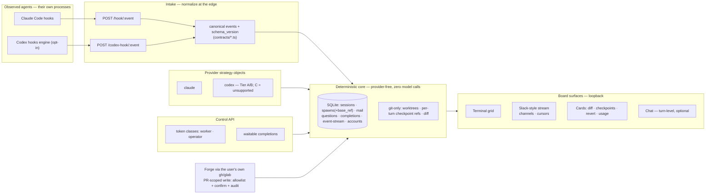

# Fleet Deck v1.0 — target-state design spec & change manifest

*The capstone of [Fleet Deck v1.0](./README.md). Two halves: **Part 1** describes v1.0 as a finished system, present tense, as if you were reading the docs the day it ships. **Part 2** is the complete before→after delta from today's **v0.22.4** — every table, route, module, config, and gate that changes. It composes the pillar docs into one picture; where you want the *why* or the mechanics, it links to them. Written 2026-08-07 against the actual tree.*

---

# Part 1 — The deck at 1.0

## 1.1 The shape, in one picture

Everything left of the core is *observed* — Fleet Deck never owns an agent's process. The core is arithmetic, SQL, and git; it makes **zero model calls**. Everything is served over **loopback**. The plugin-embedded daemon still launches under Claude Code's own Node, still **fail-open**. That is the same membrane it is today — only wider.

## 1.2 A day on the deck

The operator opens the board. The **operations strip** shows each session's burn against its tightest reset window, an 80% chip where one is close, fleet-total underneath; two windows read **"unknown"** and say so rather than guess (P4).

They browse GitHub issues from the board and **fan out four workers from four issues** — one worktree each, ticket-named (`repo--fd-PROJ-123-heron`), the issue body prefilled into the prompt **fenced as untrusted** and the spawn forced **supervised**, because issue text is third-party (P3). Two workers are `claude`, two are `codex`; every card is **honestly derived** — the Codex cards are turn-level with shell telemetry, labeled *reduced*, no conflict radar (P1).

They watch the **Slack-style stream** — a channel per session and per repo — turn boundaries, tool actions, needs-you prompts, and mail rendered as messages (P6). A Codex worker raises a shell-approval `needs-you`; the operator answers **in the channel** (it's just mail to that pane). Meanwhile a **coordinator session** they blessed as an *operator* drives its own sub-fleet through the control API and **blocks on waitable completions** — `curl /orchestration/check?wait` — waking only when a worker posts `done` (P5).

A worker finishes. The operator opens its card: **diff since spawn** against the recorded base ref, and **per-turn checkpoints** — they **revert one bad turn** (the agent is idle, so revert is allowed), annotate three diff lines, and send **one batched mail** back (P2). The worker revises in a single pass.

They point at the resulting PR. Fleet Deck checks the branch out in a fresh worktree and **spawns a reviewer running the operator's own `security-review` skill** — the daemon spawns and checks out; the *agent* reviews (P3, core stays model-free). Satisfied, they **create the PR and post the review via their own `gh`**, through the verb allowlist, with a board confirm and a feed audit line — no token ever touches `/state` or a command line (P3).

Account A is fifteen minutes from reset, so they **launch the next batch on account B** and watch the per-account bars rebalance (P4). Nothing left the machine; nothing called a model but the agents themselves.

## 1.3 The seam, composed

- **Intake normalization.** `/hook/:event` (Claude) and `/codex-hook/:event` (Codex) each map their vendor vocabulary onto **canonical events** (`session-start, prompt, tool-start, tool-end, needs-you, turn-end, session-end, file-changed, cwd-changed` + `provider` + `schema_version`) defined in `contracts/`. The state machine consumes canonical events only and no longer knows provider names. Detail: [architecture](./architecture.md).
- **Provider strategy objects.** The non-event coupling (argv, resume, pane identity, transcript path, liveness, usage reader, nudge gate) lives behind one object per provider. Claude's is extracted from today's code; Codex's implements the Tier A/B subset and returns **"unsupported"** elsewhere, so cards render exactly what the provider can honestly support.
- **The provider-free core (the membrane).** The SQLite store, callsigns/tickets, worktrees, mail queue + transport, questions, completions, checkpoints, the event-stream, and the board — none of them branch on `provider`. If one ever does, the seam has leaked.

## 1.4 The data model at 1.0

| Store | Holds | New at 1.0 |
|-------|-------|-----------|
| `sessions` | one row per observed session | — (already carries `source`) |
| `events` | the canonical event log | **`provider` column**; a **per-session turn counter** |
| `spawns` | worktree/branch bookkeeping | **`base_ref` / `base_oid`** (the diff/checkpoint foundation, P2) |
| `mail` | leased + acked transport | — (reused verbatim by notes→mail and stream posts) |
| `questions` | typed durable needs-you records | — (the pattern T0.1 copies) |
| **`completions`** | `task_id, session_id, kind(done\|blocked\|question), payload, status, acked_at` | **new table** (P5) |
| **`event_stream`** | `at, session_id, repo_id, type, payload` — the Slack-style feed | **new table** + retention + read cursors (P6) |
| **`accounts`** | per-session `config_home`, per-account usage attribution | **new** (P4; pinning is a stretch) |
| git refs | `refs/fleetdeck/<callsign>/turn-<n>` — per-turn checkpoints | **new namespace**, git-side not SQLite (P2) |

All schema changes arrive as **numbered, transactional migrations under `PRAGMA user_version`** — replacing today's ~30 unversioned, untransacted `ALTER TABLE` introspection branches (`db.mjs:261-386`). See [validation-and-gates](./validation-and-gates.md).

## 1.5 The control surface at 1.0

| Route | Purpose | Authz at 1.0 |
|-------|---------|--------------|
| `POST /hook/:event` | Claude hook intake | loopback |
| **`POST /codex-hook/:event`** | Codex hook intake | loopback |
| `POST /api/spawn` | spawn a worker | **operator token when it carries `setup_cmd`/bypass** (today: tokenless on loopback — the P0) |
| `POST /mail`, `/mail/ack` | mail transport | worker token |
| `GET /state` | snapshot | worker token |
| `GET /api/watch` | 25 s long-poll (existing) | worker token |
| **`GET /orchestration/check?wait&types`** | waitable completions | worker token (P5) |
| **diff route** | `git diff base..HEAD` + `status --porcelain` | worker token (P2) |
| **forge routes** | issue read, PR checkout, PR-scoped write | operator; write via allowlist + confirm + audit (P3) |
| **usage routes** | per-session/fleet/per-account burn | worker token (P4) |
| **skill route** | the daemon-served, versioned control skill | loopback (P5 T0.2) |
| `POST arm-unsupervised`, `/ws/term` | existing power routes | operator token |

Two token classes replace one flat bearer: **worker** (mail/state/completions/usage) and **operator** (spawn/kill/arm/forge-write) — the latter held by humans and by explicitly-blessed coordinator sessions. Agent-initiated spawns are **capped by a per-hour quota** (`spawnCapability` has no cap today). Detail: [P5](./p5-programmable-fleet.md).

## 1.6 The board at 1.0

> Control-level detail — every button, field, modal, state, and keyboard path, including the changed spawn button, the new ⚙ Settings modal, and the full terminal-access matrix — lives in the **[ui-spec](./ui-spec.md)**. This section is the summary.

- **Terminal grid** — shipped today; unchanged in kind.
- **Slack-style stream** — a new structured-event subsystem: channel-per-session/repo, read cursors, selective tool events (not a firehose), post-into-channel = mail (P6).
- **Cards** — gain the review deck: diff-since-spawn, per-turn checkpoints, "what changed this turn," idle-gated revert, line-anchored notes → one batched mail (P2); plus usage chips and per-account bars (P4).
- **Chat** — optional, explicitly secondary: a **turn-level thread** (final assistant text per turn + outbound mail) — full in-progress rendering is deferred (no live tailer today). The terminal stays authoritative (P6).
- **Permission ladder** — the two overlapping controls (the `default/acceptEdits/plan/bypassPermissions` dropdown *and* the separately-armed unsupervised checkbox) consolidate into **one four-mode ladder** — Supervised / Auto-accept-edits / Auto / Full-access — mapped across Claude's `--permission-mode` and Codex's approval×sandbox grid (P6).
- **Types** — the board consumes `contracts/` (killing the `useFleetState.js` comment-contract); `.jsx → .tsx` opportunistically (F1 / [ts-migration](./ts-migration.md)).

## 1.7 Invariants that still hold

The same five, plus two the review sharpened:

1. **Observe, never mediate** — Codex is added by consuming its hooks, not driving its app-server.
2. **Zero model calls in the core** — review-a-PR spawns an agent; the daemon stays arithmetic/SQL/git.
3. **Forge write is PR-scoped only** — the user's own `gh`/`glab`, verb allowlist, never a stored token, never the hosting workflow.
4. **Loopback, no phone-home.**
5. **Plugin, not app** — the terminal is primary; every view is a board page.
6. **(new) A privilege model, not just the human gate** — token classes + spawn caps.
7. **(new) An injection boundary** — forge text is untrusted; issue-flow spawns default supervised.

---

# Part 2 — Everything that changes, v0.22.4 → v1.0

The full delta, by subsystem. "Before" is the tree today; "After" is 1.0.

## 2.1 Change manifest

### Language, build & packaging
- **Source:** 34 `.mjs` modules (18,260 loc) → **mixed `.ts`/`.mjs`**, converted file-by-file (giants may remain `.mjs` at the cut — that's fine). New `contracts/*.ts`. See [ts-migration](./ts-migration.md).
- **Type-checking:** none (no `tsc` in repo) → **`tsc --noEmit` a required CI gate** + runtime validation of hostile boundary JSON.
- **Bundler:** esbuild, unchanged — it already handles `.ts` by extension; the shipped `fleetd.bundle.mjs` stays plain JS.
- **Dev/CI Node:** source runs require **Node 24 (or ≥22.18)** for native type-stripping; runtime `engines` floor unchanged because production ships the bundle.
- **Distribution:** `npm i -g` / plugin only → **+ optional Bun `--compile` single binary + `brew`** for the standalone board (F2, **explicitly cuttable**; `bun:sqlite` behind the `db.mjs` adapter seam).

### Providers & hooks
- **Providers:** Claude only → **Claude + Codex**. New `/codex-hook/:event` intake; Fleet Deck writes Codex telemetry hooks into `~/.codex/hooks.json` and flips `[features].codex_hooks` — **a config mutation gated behind explicit consent + an uninstall story**.
- **Seam:** Claude-coupling smeared across `events.mjs:273-424` + 8 other categories → **intake normalization + a provider strategy object** (architecture Layers 3–4).
- **Codex card:** none → **reduced-but-derived** (turn-level + shell telemetry), gated on a **one-week spike** (Tier A commit / B spike / C out). [P1](./p1-codex-provider.md).

### Data model & migrations
- **+ `base_ref`/`base_oid`** on `spawns` (lands **first**, ~1 day). **+ `provider`** + turn counter on `events`. **+ `completions`**, **+ `event_stream`**, **+ `accounts`/`config_home`** tables. **+ `refs/fleetdeck/<callsign>/turn-<n>`** git checkpoint namespace.
- **Migrations:** ~30 unversioned, untransacted `ALTER TABLE` branches → **numbered, transactional, `PRAGMA user_version`**, with stated skew/downgrade rules.

### Control API & authorization
- **Authz:** one flat bearer + a loopback exemption (spawn tokenless, `setup_cmd` → `sh -c`) → **worker/operator token classes**, `POST /api/spawn` gated when it carries `setup_cmd`/bypass, **per-hour spawn cap**. (The single most actionable security change — [P5](./p5-programmable-fleet.md).)
- **Orchestration:** mail (fire-and-forget) → **+ waitable, typed completions** with dead-worker synthesis + idempotent ack.
- **Skill:** static plugin cargo → **daemon-served, versioned** control skill (roster/spawn/assign/mail/**wait**), carrying `schema_version`.

### Forge
- **Integration:** URL composition only (`repos.mjs:120-160`, no `gh`/`glab` calls) → **real `gh`/`glab`** on the `fd/git-auth` substrate (land it first; never auto-install CLIs, never store tokens).
- **Scope:** read-only → **PR-scoped write** (create PR / post review / comment) as a **verb allowlist** with board confirm + feed audit; **GitHub + GitLab only** (Jira/Linear cut).
- **Flows:** **+ issue → parallel-agent fan-out**, **+ point-at-PR → reviewer** running the user's own skill.

### Usage & accounts
- **Meters:** none → **Claude usage meter** (reset windows, 80% chip, fleet-total, tightest-first, local price table) + **Codex burn** with a first-class **"unknown, never guess"** state (rollout `rate_limits: null` upstream; tail huge logs); **optionally consume the CPA usage queue**.
- **Accounts:** single home → **multi-account**, per-account bars, **spawn pinned via `config_home`** (a **stretch**; needs the transcript-path refactor — the same `transcript{path}` strategy method). [P4](./p4-usage-accounts.md).

### Board & review deck
- **+ Slack-style stream** (new event subsystem, channels, cursors). **+ diff renderer** (new; `FileViewer` today is plain-text, no diff mode). **+ per-turn checkpoints / revert UI**. **+ notes → one batched mail**. **+ usage chips / per-account bars**. **+ optional turn-level chat**. **Permission ladder consolidated** to four modes. **JSX → TSX** partial.
- **Chrome:** `+ Spawn` becomes a **split button** (quick spawn · from issues · review a PR); **+ ⚙ Settings modal** (Integrations / Gateway & proxies / Providers / Accounts / Access & tokens — the gateway profile **moves out of the spawn form** into it); **+ ▤ Stream** and **usage chip** header buttons, capability-gated so an old daemon shows today's board. Full inventory: [ui-spec](./ui-spec.md).

### Tests, CI & docs
- **+ `tsc --noEmit` lane**; **+ two-runtime matrix** (node:sqlite × bun:sqlite) for F2; **+ per-provider hook-shape fixtures**, **git-fixture repos** for diff/checkpoints, a **privilege-matrix test** (worker token can't spawn), **injection fixtures**, **usage-file fixtures incl. `rate_limits:null`**. The 124-file suite (34,581 loc) **stays green throughout** ([[test-suite-is-trust]]).
- **+ `docs/v1/`** (this set); **+ docs/internals** (glossary, route map, state-machine doc built on the canonical vocabulary).

### Explicitly *not* changing (so the delta is honest)
ACP/SDK "mediate" model; hosted relay / native mobile; remote spawn (Coder/LAN stays); Jira/Linear; Design Mode; LLM-written niceties (auto titles). All remain deferred — see [README](./README.md#deferred-to-post-10).

## 2.2 Scope at a glance, per pillar

| Pillar | New tables/cols | New routes | New modules/dirs | Board | Cuttable |
|--------|-----------------|-----------|------------------|-------|----------|
| **F1** | — | — | `contracts/`, `tsconfig`, tsc lane | contracts import; `.tsx` | F1a no |
| **F2** | — | — | `db` adapter alias; Bun binary | — | **yes** |
| **P1** | `provider`, turn counter | `/codex-hook/:event` | `providers/`, `hooks/` normalization | Codex cards | Tier B/C yes |
| **P2** | `base_ref`/`base_oid`, checkpoint refs | diff route | checkpoint writer, diff renderer | diff · checkpoints · revert · notes | core no |
| **P3** | — | forge read/checkout/write | `fd/git-auth`, issue/PR flows | issue browser · PR review | Jira/Linear; write→read-only |
| **P4** | `accounts`/`config_home` | usage routes | usage readers, CPA queue | usage chips · per-account bars | pinning stretch |
| **P5** | `completions` | `/orchestration/check`, skill route | completions + waiter, token middleware | — | skill polish yes; privilege no |
| **P6** | `event_stream` | stream/channel fetch | stream subsystem | stream · chat · ladder | chat → post-1.0 |

## 2.3 What upgrading from v0.22.4 feels like

- **Nothing to install.** The plugin path still launches the daemon under Claude's own Node; `node:sqlite`; no `npm install`. Brew is additive and optional.
- **Migrations auto-run** on first boot of the new daemon, numbered and transactional under `user_version`; a partial failure rolls back rather than half-applying.
- **Skew rules are stated:** old daemon + new board, new hooks + old daemon (the SessionStart shim already prefers a committed bundle), and a **downgrade answer** — all specified in [validation-and-gates](./validation-and-gates.md).
- **`schema_version`** on canonical events and the served skill lets hooks/agents detect a version mismatch instead of silently misbehaving.

## 2.4 The order these land in

The manifest ships in the [README's revised sequence](./README.md#sequencing-to-10-revised): (1) base-ref + F1a contracts; (2) P2 harvest + P5 completions + the P1 spike, in parallel; (3) P1 provider + P4 Claude meter; (4) P3 + P4 Codex usage; (5) P5 privilege + served skill; (6) P6 stream→chat→ladder; (7) F2 (cuttable); (8) security-delta gate → **cut v1.0**.

---

## Definition of done

Fleet Deck 1.0 is cut when **every Part-2 change has landed or been explicitly cut with a stated reason**, **every Part-1 invariant still holds** (proven per pillar), and the [validation-and-gates](./validation-and-gates.md) checklist passes: per-pillar fail-open/determinism/exposure proofs demonstrated, migrations numbered/transactional, the 124-file suite green on both runtimes, performance bars met, the platform matrix stated, and the security-delta review passed. The result is the system in Part 1 — multi-provider, issue-to-PR, a real review deck, operationally aware, agent-drivable — still a fail-open, loopback, deterministic-core plugin.
